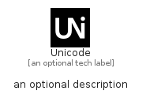

# Unicode


```text
simpleicons/U/Unicode
```

```text
include('simpleicons/U/Unicode')
```


| Illustration | Unicode |
| :---: | :---: |
|  |  |


## Sprites
The item provides the following sriptes:

- `<$UnicodeXs>`
- `<$UnicodeSm>`
- `<$UnicodeMd>`
- `<$UnicodeLg>`


## Unicode

### Load remotely
```plantuml
@startuml
' configures the library
!global $LIB_BASE_LOCATION="https://raw.githubusercontent.com/tmorin/plantuml-libs/master/distribution"

' loads the library's bootstrap
!include $LIB_BASE_LOCATION/bootstrap.puml

' loads the package bootstrap
include('simpleicons/bootstrap')

' loads the Item which embeds the element Unicode
include('simpleicons/U/Unicode')

' renders the element
Unicode('Unicode', 'Unicode', 'an optional tech label', 'an optional description')
@enduml
```

### Load locally
```plantuml
@startuml
' configures the library
!global $INCLUSION_MODE="local"
!global $LIB_BASE_LOCATION="../.."

' loads the library's bootstrap
!include $LIB_BASE_LOCATION/bootstrap.puml

' loads the package bootstrap
include('simpleicons/bootstrap')

' loads the Item which embeds the element Unicode
include('simpleicons/U/Unicode')

' renders the element
Unicode('Unicode', 'Unicode', 'an optional tech label', 'an optional description')
@enduml
```

