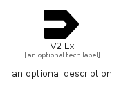

# V2Ex


```text
simpleicons/V/V2Ex
```

```text
include('simpleicons/V/V2Ex')
```


| Illustration | V2Ex |
| :---: | :---: |
|  |  |


## Sprites
The item provides the following sriptes:

- `<$V2ExXs>`
- `<$V2ExSm>`
- `<$V2ExMd>`
- `<$V2ExLg>`


## V2Ex

### Load remotely
```plantuml
@startuml
' configures the library
!global $LIB_BASE_LOCATION="https://raw.githubusercontent.com/tmorin/plantuml-libs/master/distribution"

' loads the library's bootstrap
!include $LIB_BASE_LOCATION/bootstrap.puml

' loads the package bootstrap
include('simpleicons/bootstrap')

' loads the Item which embeds the element V2Ex
include('simpleicons/V/V2Ex')

' renders the element
V2Ex('V2Ex', 'V2 Ex', 'an optional tech label', 'an optional description')
@enduml
```

### Load locally
```plantuml
@startuml
' configures the library
!global $INCLUSION_MODE="local"
!global $LIB_BASE_LOCATION="../.."

' loads the library's bootstrap
!include $LIB_BASE_LOCATION/bootstrap.puml

' loads the package bootstrap
include('simpleicons/bootstrap')

' loads the Item which embeds the element V2Ex
include('simpleicons/V/V2Ex')

' renders the element
V2Ex('V2Ex', 'V2 Ex', 'an optional tech label', 'an optional description')
@enduml
```

