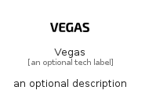

# Vegas


```text
simpleicons/V/Vegas
```

```text
include('simpleicons/V/Vegas')
```


| Illustration | Vegas |
| :---: | :---: |
|  |  |


## Sprites
The item provides the following sriptes:

- `<$VegasXs>`
- `<$VegasSm>`
- `<$VegasMd>`
- `<$VegasLg>`


## Vegas

### Load remotely
```plantuml
@startuml
' configures the library
!global $LIB_BASE_LOCATION="https://raw.githubusercontent.com/tmorin/plantuml-libs/master/distribution"

' loads the library's bootstrap
!include $LIB_BASE_LOCATION/bootstrap.puml

' loads the package bootstrap
include('simpleicons/bootstrap')

' loads the Item which embeds the element Vegas
include('simpleicons/V/Vegas')

' renders the element
Vegas('Vegas', 'Vegas', 'an optional tech label', 'an optional description')
@enduml
```

### Load locally
```plantuml
@startuml
' configures the library
!global $INCLUSION_MODE="local"
!global $LIB_BASE_LOCATION="../.."

' loads the library's bootstrap
!include $LIB_BASE_LOCATION/bootstrap.puml

' loads the package bootstrap
include('simpleicons/bootstrap')

' loads the Item which embeds the element Vegas
include('simpleicons/V/Vegas')

' renders the element
Vegas('Vegas', 'Vegas', 'an optional tech label', 'an optional description')
@enduml
```

