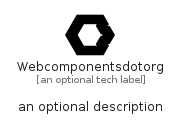

# Webcomponentsdotorg


```text
simpleicons/W/Webcomponentsdotorg
```

```text
include('simpleicons/W/Webcomponentsdotorg')
```


| Illustration | Webcomponentsdotorg |
| :---: | :---: |
|  |  |


## Sprites
The item provides the following sriptes:

- `<$WebcomponentsdotorgXs>`
- `<$WebcomponentsdotorgSm>`
- `<$WebcomponentsdotorgMd>`
- `<$WebcomponentsdotorgLg>`


## Webcomponentsdotorg

### Load remotely
```plantuml
@startuml
' configures the library
!global $LIB_BASE_LOCATION="https://raw.githubusercontent.com/tmorin/plantuml-libs/master/distribution"

' loads the library's bootstrap
!include $LIB_BASE_LOCATION/bootstrap.puml

' loads the package bootstrap
include('simpleicons/bootstrap')

' loads the Item which embeds the element Webcomponentsdotorg
include('simpleicons/W/Webcomponentsdotorg')

' renders the element
Webcomponentsdotorg('Webcomponentsdotorg', 'Webcomponentsdotorg', 'an optional tech label', 'an optional description')
@enduml
```

### Load locally
```plantuml
@startuml
' configures the library
!global $INCLUSION_MODE="local"
!global $LIB_BASE_LOCATION="../.."

' loads the library's bootstrap
!include $LIB_BASE_LOCATION/bootstrap.puml

' loads the package bootstrap
include('simpleicons/bootstrap')

' loads the Item which embeds the element Webcomponentsdotorg
include('simpleicons/W/Webcomponentsdotorg')

' renders the element
Webcomponentsdotorg('Webcomponentsdotorg', 'Webcomponentsdotorg', 'an optional tech label', 'an optional description')
@enduml
```

