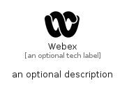

# Webex


```text
simpleicons/W/Webex
```

```text
include('simpleicons/W/Webex')
```


| Illustration | Webex |
| :---: | :---: |
|  |  |


## Sprites
The item provides the following sriptes:

- `<$WebexXs>`
- `<$WebexSm>`
- `<$WebexMd>`
- `<$WebexLg>`


## Webex

### Load remotely
```plantuml
@startuml
' configures the library
!global $LIB_BASE_LOCATION="https://raw.githubusercontent.com/tmorin/plantuml-libs/master/distribution"

' loads the library's bootstrap
!include $LIB_BASE_LOCATION/bootstrap.puml

' loads the package bootstrap
include('simpleicons/bootstrap')

' loads the Item which embeds the element Webex
include('simpleicons/W/Webex')

' renders the element
Webex('Webex', 'Webex', 'an optional tech label', 'an optional description')
@enduml
```

### Load locally
```plantuml
@startuml
' configures the library
!global $INCLUSION_MODE="local"
!global $LIB_BASE_LOCATION="../.."

' loads the library's bootstrap
!include $LIB_BASE_LOCATION/bootstrap.puml

' loads the package bootstrap
include('simpleicons/bootstrap')

' loads the Item which embeds the element Webex
include('simpleicons/W/Webex')

' renders the element
Webex('Webex', 'Webex', 'an optional tech label', 'an optional description')
@enduml
```

