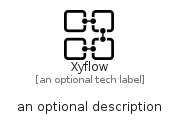

# Xyflow


```text
simpleicons/X/Xyflow
```

```text
include('simpleicons/X/Xyflow')
```


| Illustration | Xyflow |
| :---: | :---: |
|  |  |


## Sprites
The item provides the following sriptes:

- `<$XyflowXs>`
- `<$XyflowSm>`
- `<$XyflowMd>`
- `<$XyflowLg>`


## Xyflow

### Load remotely
```plantuml
@startuml
' configures the library
!global $LIB_BASE_LOCATION="https://raw.githubusercontent.com/tmorin/plantuml-libs/master/distribution"

' loads the library's bootstrap
!include $LIB_BASE_LOCATION/bootstrap.puml

' loads the package bootstrap
include('simpleicons/bootstrap')

' loads the Item which embeds the element Xyflow
include('simpleicons/X/Xyflow')

' renders the element
Xyflow('Xyflow', 'Xyflow', 'an optional tech label', 'an optional description')
@enduml
```

### Load locally
```plantuml
@startuml
' configures the library
!global $INCLUSION_MODE="local"
!global $LIB_BASE_LOCATION="../.."

' loads the library's bootstrap
!include $LIB_BASE_LOCATION/bootstrap.puml

' loads the package bootstrap
include('simpleicons/bootstrap')

' loads the Item which embeds the element Xyflow
include('simpleicons/X/Xyflow')

' renders the element
Xyflow('Xyflow', 'Xyflow', 'an optional tech label', 'an optional description')
@enduml
```

