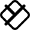

# Y

The module contains 25 items.

| |Name|
|:---:|---|
|  | [simpleicons/Y/Yaak](../../simpleicons/Y/Yaak.md) |
|  | [simpleicons/Y/Yabai](../../simpleicons/Y/Yabai.md) |
|  | [simpleicons/Y/Yale](../../simpleicons/Y/Yale.md) |
|  | [simpleicons/Y/Yamahacorporation](../../simpleicons/Y/Yamahacorporation.md) |
|  | [simpleicons/Y/Yamahamotorcorporation](../../simpleicons/Y/Yamahamotorcorporation.md) |
|  | [simpleicons/Y/Yaml](../../simpleicons/Y/Yaml.md) |
|  | [simpleicons/Y/Yandexcloud](../../simpleicons/Y/Yandexcloud.md) |
|  | [simpleicons/Y/Yarn](../../simpleicons/Y/Yarn.md) |
|  | [simpleicons/Y/Ycombinator](../../simpleicons/Y/Ycombinator.md) |
|  | [simpleicons/Y/Yelp](../../simpleicons/Y/Yelp.md) |
|  | [simpleicons/Y/Yeti](../../simpleicons/Y/Yeti.md) |
|  | [simpleicons/Y/Yii](../../simpleicons/Y/Yii.md) |
|  | [simpleicons/Y/Yoast](../../simpleicons/Y/Yoast.md) |
|  | [simpleicons/Y/Yolo](../../simpleicons/Y/Yolo.md) |
|  | [simpleicons/Y/Youhodler](../../simpleicons/Y/Youhodler.md) |
|  | [simpleicons/Y/Youtube](../../simpleicons/Y/Youtube.md) |
|  | [simpleicons/Y/Youtubegaming](../../simpleicons/Y/Youtubegaming.md) |
|  | [simpleicons/Y/Youtubekids](../../simpleicons/Y/Youtubekids.md) |
|  | [simpleicons/Y/Youtubemusic](../../simpleicons/Y/Youtubemusic.md) |
|  | [simpleicons/Y/Youtubeshorts](../../simpleicons/Y/Youtubeshorts.md) |
|  | [simpleicons/Y/Youtubestudio](../../simpleicons/Y/Youtubestudio.md) |
|  | [simpleicons/Y/Youtubetv](../../simpleicons/Y/Youtubetv.md) |
|  | [simpleicons/Y/Yr](../../simpleicons/Y/Yr.md) |
|  | [simpleicons/Y/Yubico](../../simpleicons/Y/Yubico.md) |
|  | [simpleicons/Y/Yunohost](../../simpleicons/Y/Yunohost.md) |

