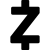
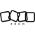

# Z

The module contains 44 items.

| |Name|
|:---:|---|
|  | [simpleicons/Z/Zabka](../../simpleicons/Z/Zabka.md) |
|  | [simpleicons/Z/Zaim](../../simpleicons/Z/Zaim.md) |
|  | [simpleicons/Z/Zalando](../../simpleicons/Z/Zalando.md) |
|  | [simpleicons/Z/Zalo](../../simpleicons/Z/Zalo.md) |
|  | [simpleicons/Z/Zap](../../simpleicons/Z/Zap.md) |
|  | [simpleicons/Z/Zapier](../../simpleicons/Z/Zapier.md) |
|  | [simpleicons/Z/Zara](../../simpleicons/Z/Zara.md) |
|  | [simpleicons/Z/Zazzle](../../simpleicons/Z/Zazzle.md) |
|  | [simpleicons/Z/Zcash](../../simpleicons/Z/Zcash.md) |
|  | [simpleicons/Z/Zcool](../../simpleicons/Z/Zcool.md) |
|  | [simpleicons/Z/Zdf](../../simpleicons/Z/Zdf.md) |
|  | [simpleicons/Z/Zebpay](../../simpleicons/Z/Zebpay.md) |
|  | [simpleicons/Z/Zebratechnologies](../../simpleicons/Z/Zebratechnologies.md) |
|  | [simpleicons/Z/Zedindustries](../../simpleicons/Z/Zedindustries.md) |
|  | [simpleicons/Z/Zelle](../../simpleicons/Z/Zelle.md) |
|  | [simpleicons/Z/Zenbrowser](../../simpleicons/Z/Zenbrowser.md) |
|  | [simpleicons/Z/Zend](../../simpleicons/Z/Zend.md) |
|  | [simpleicons/Z/Zendesk](../../simpleicons/Z/Zendesk.md) |
|  | [simpleicons/Z/Zenn](../../simpleicons/Z/Zenn.md) |
|  | [simpleicons/Z/Zenodo](../../simpleicons/Z/Zenodo.md) |
|  | [simpleicons/Z/Zensar](../../simpleicons/Z/Zensar.md) |
|  | [simpleicons/Z/Zerodha](../../simpleicons/Z/Zerodha.md) |
|  | [simpleicons/Z/Zerotier](../../simpleicons/Z/Zerotier.md) |
|  | [simpleicons/Z/Zettlr](../../simpleicons/Z/Zettlr.md) |
|  | [simpleicons/Z/Zhihu](../../simpleicons/Z/Zhihu.md) |
|  | [simpleicons/Z/Zig](../../simpleicons/Z/Zig.md) |
|  | [simpleicons/Z/Zigbee](../../simpleicons/Z/Zigbee.md) |
|  | [simpleicons/Z/Zigbee2Mqtt](../../simpleicons/Z/Zigbee2Mqtt.md) |
|  | [simpleicons/Z/Ziggo](../../simpleicons/Z/Ziggo.md) |
|  | [simpleicons/Z/Zilch](../../simpleicons/Z/Zilch.md) |
|  | [simpleicons/Z/Zillow](../../simpleicons/Z/Zillow.md) |
|  | [simpleicons/Z/Zincsearch](../../simpleicons/Z/Zincsearch.md) |
|  | [simpleicons/Z/Zingat](../../simpleicons/Z/Zingat.md) |
|  | [simpleicons/Z/Zod](../../simpleicons/Z/Zod.md) |
|  | [simpleicons/Z/Zoho](../../simpleicons/Z/Zoho.md) |
|  | [simpleicons/Z/Zoiper](../../simpleicons/Z/Zoiper.md) |
|  | [simpleicons/Z/Zola](../../simpleicons/Z/Zola.md) |
|  | [simpleicons/Z/Zomato](../../simpleicons/Z/Zomato.md) |
|  | [simpleicons/Z/Zoom](../../simpleicons/Z/Zoom.md) |
|  | [simpleicons/Z/Zorin](../../simpleicons/Z/Zorin.md) |
|  | [simpleicons/Z/Zotero](../../simpleicons/Z/Zotero.md) |
|  | [simpleicons/Z/Zsh](../../simpleicons/Z/Zsh.md) |
|  | [simpleicons/Z/Zulip](../../simpleicons/Z/Zulip.md) |
|  | [simpleicons/Z/Zyte](../../simpleicons/Z/Zyte.md) |

