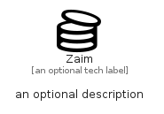

# Zaim


```text
simpleicons/Z/Zaim
```

```text
include('simpleicons/Z/Zaim')
```


| Illustration | Zaim |
| :---: | :---: |
|  |  |


## Sprites
The item provides the following sriptes:

- `<$ZaimXs>`
- `<$ZaimSm>`
- `<$ZaimMd>`
- `<$ZaimLg>`


## Zaim

### Load remotely
```plantuml
@startuml
' configures the library
!global $LIB_BASE_LOCATION="https://raw.githubusercontent.com/tmorin/plantuml-libs/master/distribution"

' loads the library's bootstrap
!include $LIB_BASE_LOCATION/bootstrap.puml

' loads the package bootstrap
include('simpleicons/bootstrap')

' loads the Item which embeds the element Zaim
include('simpleicons/Z/Zaim')

' renders the element
Zaim('Zaim', 'Zaim', 'an optional tech label', 'an optional description')
@enduml
```

### Load locally
```plantuml
@startuml
' configures the library
!global $INCLUSION_MODE="local"
!global $LIB_BASE_LOCATION="../.."

' loads the library's bootstrap
!include $LIB_BASE_LOCATION/bootstrap.puml

' loads the package bootstrap
include('simpleicons/bootstrap')

' loads the Item which embeds the element Zaim
include('simpleicons/Z/Zaim')

' renders the element
Zaim('Zaim', 'Zaim', 'an optional tech label', 'an optional description')
@enduml
```

