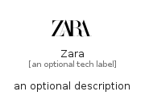

# Zara


```text
simpleicons/Z/Zara
```

```text
include('simpleicons/Z/Zara')
```


| Illustration | Zara |
| :---: | :---: |
|  |  |


## Sprites
The item provides the following sriptes:

- `<$ZaraXs>`
- `<$ZaraSm>`
- `<$ZaraMd>`
- `<$ZaraLg>`


## Zara

### Load remotely
```plantuml
@startuml
' configures the library
!global $LIB_BASE_LOCATION="https://raw.githubusercontent.com/tmorin/plantuml-libs/master/distribution"

' loads the library's bootstrap
!include $LIB_BASE_LOCATION/bootstrap.puml

' loads the package bootstrap
include('simpleicons/bootstrap')

' loads the Item which embeds the element Zara
include('simpleicons/Z/Zara')

' renders the element
Zara('Zara', 'Zara', 'an optional tech label', 'an optional description')
@enduml
```

### Load locally
```plantuml
@startuml
' configures the library
!global $INCLUSION_MODE="local"
!global $LIB_BASE_LOCATION="../.."

' loads the library's bootstrap
!include $LIB_BASE_LOCATION/bootstrap.puml

' loads the package bootstrap
include('simpleicons/bootstrap')

' loads the Item which embeds the element Zara
include('simpleicons/Z/Zara')

' renders the element
Zara('Zara', 'Zara', 'an optional tech label', 'an optional description')
@enduml
```

