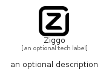

# Ziggo


```text
simpleicons/Z/Ziggo
```

```text
include('simpleicons/Z/Ziggo')
```


| Illustration | Ziggo |
| :---: | :---: |
|  |  |


## Sprites
The item provides the following sriptes:

- `<$ZiggoXs>`
- `<$ZiggoSm>`
- `<$ZiggoMd>`
- `<$ZiggoLg>`


## Ziggo

### Load remotely
```plantuml
@startuml
' configures the library
!global $LIB_BASE_LOCATION="https://raw.githubusercontent.com/tmorin/plantuml-libs/master/distribution"

' loads the library's bootstrap
!include $LIB_BASE_LOCATION/bootstrap.puml

' loads the package bootstrap
include('simpleicons/bootstrap')

' loads the Item which embeds the element Ziggo
include('simpleicons/Z/Ziggo')

' renders the element
Ziggo('Ziggo', 'Ziggo', 'an optional tech label', 'an optional description')
@enduml
```

### Load locally
```plantuml
@startuml
' configures the library
!global $INCLUSION_MODE="local"
!global $LIB_BASE_LOCATION="../.."

' loads the library's bootstrap
!include $LIB_BASE_LOCATION/bootstrap.puml

' loads the package bootstrap
include('simpleicons/bootstrap')

' loads the Item which embeds the element Ziggo
include('simpleicons/Z/Ziggo')

' renders the element
Ziggo('Ziggo', 'Ziggo', 'an optional tech label', 'an optional description')
@enduml
```

