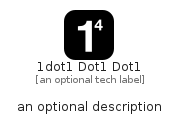

# _1Dot1Dot1Dot1


```text
simpleicons/_/_1Dot1Dot1Dot1
```

```text
include('simpleicons/_/_1Dot1Dot1Dot1')
```


| Illustration | _1Dot1Dot1Dot1 |
| :---: | :---: |
|  |  |


## Sprites
The item provides the following sriptes:

- `<$_1Dot1Dot1Dot1Xs>`
- `<$_1Dot1Dot1Dot1Sm>`
- `<$_1Dot1Dot1Dot1Md>`
- `<$_1Dot1Dot1Dot1Lg>`


## _1Dot1Dot1Dot1

### Load remotely
```plantuml
@startuml
' configures the library
!global $LIB_BASE_LOCATION="https://raw.githubusercontent.com/tmorin/plantuml-libs/master/distribution"

' loads the library's bootstrap
!include $LIB_BASE_LOCATION/bootstrap.puml

' loads the package bootstrap
include('simpleicons/bootstrap')

' loads the Item which embeds the element _1Dot1Dot1Dot1
include('simpleicons/_/_1Dot1Dot1Dot1')

' renders the element
_1Dot1Dot1Dot1('1dot1Dot1Dot1', '1dot1 Dot1 Dot1', 'an optional tech label', 'an optional description')
@enduml
```

### Load locally
```plantuml
@startuml
' configures the library
!global $INCLUSION_MODE="local"
!global $LIB_BASE_LOCATION="../.."

' loads the library's bootstrap
!include $LIB_BASE_LOCATION/bootstrap.puml

' loads the package bootstrap
include('simpleicons/bootstrap')

' loads the Item which embeds the element _1Dot1Dot1Dot1
include('simpleicons/_/_1Dot1Dot1Dot1')

' renders the element
_1Dot1Dot1Dot1('1dot1Dot1Dot1', '1dot1 Dot1 Dot1', 'an optional tech label', 'an optional description')
@enduml
```

