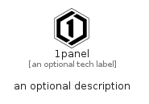

# _1Panel


```text
simpleicons/_/_1Panel
```

```text
include('simpleicons/_/_1Panel')
```


| Illustration | _1Panel |
| :---: | :---: |
|  |  |


## Sprites
The item provides the following sriptes:

- `<$_1PanelXs>`
- `<$_1PanelSm>`
- `<$_1PanelMd>`
- `<$_1PanelLg>`


## _1Panel

### Load remotely
```plantuml
@startuml
' configures the library
!global $LIB_BASE_LOCATION="https://raw.githubusercontent.com/tmorin/plantuml-libs/master/distribution"

' loads the library's bootstrap
!include $LIB_BASE_LOCATION/bootstrap.puml

' loads the package bootstrap
include('simpleicons/bootstrap')

' loads the Item which embeds the element _1Panel
include('simpleicons/_/_1Panel')

' renders the element
_1Panel('1panel', '1panel', 'an optional tech label', 'an optional description')
@enduml
```

### Load locally
```plantuml
@startuml
' configures the library
!global $INCLUSION_MODE="local"
!global $LIB_BASE_LOCATION="../.."

' loads the library's bootstrap
!include $LIB_BASE_LOCATION/bootstrap.puml

' loads the package bootstrap
include('simpleicons/bootstrap')

' loads the Item which embeds the element _1Panel
include('simpleicons/_/_1Panel')

' renders the element
_1Panel('1panel', '1panel', 'an optional tech label', 'an optional description')
@enduml
```

