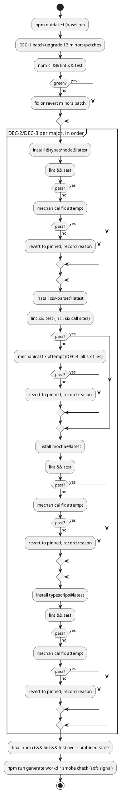

# Title

npm dependency upgrade for `@tmorin/plantuml-libs` (wave 001, run W-1)

# Summary

Bring the project's 17 outdated npm packages current, including the four
pending majors (`@types/node` 25→26, `csv-parse` 6→7, `mocha` 11→12,
`typescript` 6→7), using the repository's own
`.claude/skills/npm-dependency-management` procedure, without regressing
`npm run lint` or `npm test`. No PRD exists for this run — **traceability is
incomplete**; requirements below are sourced directly from the wave manifest
(`docs/wav/wav-001-dependency-ci-refresh/wav-001-dependency-ci-refresh.md`,
run `W-1`) and its business case, per this run's `TDD+pln` document profile
(infra-only work, scope already settled by the wave, no `prd` needed).

# Scope

In scope: `package.json` and `package-lock.json` dependency/devDependency
version bumps, and any `source/**/*.ts` source change strictly required to
keep the build green after a bump (e.g. an import or API-shape change
forced by a major version).

Out of scope: the five icon/shape package content refreshes (wave runs
W-3..W-7), the CI/CD workflow changes (wave run W-2), any dependency not
reported by `npm outdated` at run time, and any source refactor not forced
by a dependency bump. Note the one narrow exception: `IMP-3`/`CTR-1` may
still touch the single `csv-parse` import line inside
`source/library/packages/aws/index.ts` (and the other four packages'
`index.ts`) if `DEC-4` fires — that is a mechanical import/signature fix
forced by the dependency bump, not icon content, and stays in scope.

# PRD Traceability

No PRD exists for this run (`TDD+pln` profile). Requirements are sourced
directly from:

- Wave manifest `W-1` entry (`wav-001-dependency-ci-refresh.md`): "bring npm
  dependencies current, including the 4 pending majors ..., without
  breaking the build."
- Business case (`wbc-001-dependency-ci-refresh.md`), Context section: 17
  packages outdated via `npm outdated`, four of them major.
- Wave Risks section: "Major version bumps in W-1 ... may carry breaking
  changes. The run should hold back and document any major that fails
  lint/test rather than force it through."

All three are addressed by this TDD; none are unresolved.

# Technical Goals

- `TG-1` — Every one of the 17 packages `npm outdated` reports at run start
  is either upgraded to its `latest` version, or explicitly held back with
  a documented reason in this run's prg.
- `TG-2` — `npm run lint` and `npm test` pass against the final
  `package.json`/`package-lock.json` state.
- `TG-3` — `csv-parse`, used by six files
  (`source/generator/workdir/discovery.ts`,
  `source/library/packages/{aws,c4model,c4k8s,domainstorytelling,eventstorming}/index.ts`),
  ends the run on one consistent version across all six — no partial
  upgrade that leaves call sites on different API shapes.
- `TG-4` — `package-lock.json` stays internally consistent with
  `package.json` (`npm ci` installs cleanly from it) throughout, not just
  at the end.

# Non-Goals

- Does not touch `.github/workflows/**` (wave run W-2's scope).
- Does not touch any `source/library/packages/{aws,azure,fontawesome,gcp,simpleicons}` icon content (wave runs W-3, W-4, W-5, W-6, W-7's scope).
- Does not add new dependencies or remove currently-used ones — only version bumps of what's already declared.
- Does not change `engines.node` (`>=24 <25`) unless a major bump makes it strictly necessary (none of the four majors is expected to, per Step 1 research below).

# Assumptions

- `ASM-1` — `npm outdated`'s 17-package list from wave-authoring time
  (2026-10-04) is still substantially accurate at execution time; this run
  re-runs `npm outdated` itself at Stage 10 start rather than trusting the
  wave's snapshot, since package registries move daily. Validated by
  re-running the command before touching `package.json`.
- `ASM-2` — the repository's existing test suite (`npm test` = `mocha`,
  per `package.json`) and `npm run lint` (`eslint .`) are sufficient
  regression signal for this change; there is no separate integration/e2e
  suite this run must also run. Validated by inspecting `package.json`
  `scripts` (confirmed: only `lint` and `test` are validation scripts;
  `generate:workdir`/`generate:website` require Podman/Docker and are out
  of reach in this environment, so they are not used as a gate here but
  are checked for obvious breakage by type-checking via lint/`ts-node`
  where cheap).
- `ASM-3` — none of the four majors requires a Node.js engine bump beyond
  the current `>=24 <25` constraint. `@types/node` 26.x targets Node 26
  *types* but is additive (newer global/type additions), not a runtime
  requirement; `typescript` 7, `mocha` 12, and `csv-parse` 7 are not known
  to raise a Node floor past 24. Validated empirically: if `npm ci`/`npm
  test` fails in a way that traces to a Node version mismatch, this
  assumption is wrong and that major is held back per `DEC-2`.

# Constraints

- `CON-1` — Node.js `>=24 <25` (package.json `engines`), not to be changed by this run (see Non-Goals).
- `CON-2` — CommonJS package shape (`bin/gdiag.js` uses `require()`) despite ESM `import` syntax in `source/**/*.ts`; no dependency bump may require switching the package to `"type": "module"`.
- `CON-3` — No semicolons, double-quote strings (Prettier `.prettierrc.json` + ESLint flat config `eslint.config.mjs`) — any source edit forced by a major bump must match this house style.
- `CON-4` — This environment cannot run Podman/Docker, so `scripts/generate-library.sh` and `npm run generate:package` cannot be exercised here; `npm run generate:workdir` (`ts-node`, no container) *can* run and is a useful smoke check for `csv-parse`/`typescript` compatibility.

# Current State

- `package.json` devDependencies include `csv-parse: ^6.2.1`, `mocha: ^11.7.6`, `typescript: ^6.0.3`, `@types/node: ^25.9.1`, plus 13 other packages at a `Wanted` version behind `Latest` (patch/minor only — see Repository Impact for the itemized list captured at drafting time).
- `tsconfig.json` is minimal: `allowSyntheticDefaultImports`, `esModuleInterop`, `moduleResolution: "Node"`, `resolveJsonModule`; no `target`/`lib`/`strict` set, so TypeScript's own version defaults govern type-checking strictness — a major TS bump can change behavior here without any config edit.
- `eslint.config.mjs` is a flat config built via `@eslint/eslintrc`'s `FlatCompat`, extending `eslint:recommended` and `@typescript-eslint/recommended`; a stale `.eslintrc.js` stub exists only as a legacy marker (`root: true`) and is not the active config.
- No `.mocharc.*` file exists; `npm test` runs bare `mocha`, which uses mocha's own default spec discovery (`./test/*.spec.{js,cjs,mjs}` by mocha's built-in default) — confirmed against `test/*.spec.js`/`test/*.spec.mjs` files present (`gdiag.spec.js`, `resolve-aws-icons.spec.mjs`, `resolve-azure-icons.spec.mjs`).
- `csv-parse/sync`'s `parse()` is imported identically in all six call sites: `import { parse } from "csv-parse/sync"`.
- No `docs/adr/` register, no `docs/CLAUDE.md` register declaration, and no `docs/bkg/` directory exist in this repository (confirmed by directory listing) — this run has no binding ADRs to check and no canonical/backlog register to update.

# Proposed Design

Follow `.claude/skills/npm-dependency-management/SKILL.md`'s workflow
directly rather than inventing a new procedure: audit → plan safe upgrades
→ apply → validate → troubleshoot failures → document. The only addition
this TDD makes to that generic skill is sequencing specific to this
repository's risk surface (`DEC-1`..`DEC-4` below) — no new component,
service, or architecture is introduced, so no component/class diagram
applies (diagram trigger 1 does not fire: this is a dependency-version
change, not a new relationship between modules).

`DEC-1` — Batch the 13 non-major (patch/minor) upgrades together first, in
one `npm install` pass, before touching any of the four majors.

- Decision: Run `npm update` (or targeted `npm install pkg@wanted`) for every
  package whose `Wanted` upgrade is not a major version bump, commit that as
  a clean baseline state (validated green), then handle each major
  individually. If this batch fails `npm run lint`/`npm test`, bisect to the
  offending package(s) (reinstall them one at a time against the prior
  lockfile state to isolate which one regressed) and apply the same
  mechanical-fix-or-revert triage as `DEC-2` to each offender — there is no
  separate failure procedure for minors versus majors, only a different
  starting batch size.
- Rationale: Patch/minor bumps are declared semver-compatible by their
  authors and carry materially lower regression risk; batching them first
  establishes a known-green floor so that if a later major bump breaks
  something, the diff under investigation is just that one major, not 17
  packages at once.
- Alternatives considered: (a) upgrade everything in one shot — rejected,
  makes failure triage ambiguous across 17 simultaneous version changes;
  (b) upgrade one package at a time regardless of major/minor — rejected,
  needlessly slow for 13 packages the skill itself calls "always safe".
- Tradeoffs: one extra validation cycle (minors, then each major) instead
  of one; acceptable given the `hold back and document` requirement needs
  per-major isolation anyway.
- Linked requirements: wave `W-1` focus line; business case Problems/Opportunities.

`DEC-2` — Attempt each of the four majors independently, in dependency-risk
order: `@types/node` → `csv-parse` → `mocha` → `typescript`; hold back and
document (do not revert past this run's final state) any major whose
upgrade attempt fails `npm run lint` or `npm test` after a reasonable,
scope-preserving fix attempt.

- Decision: For each major, `npm install <pkg>@latest`, run `npm run lint`
  then `npm test`; if both pass, keep it and move to the next major.
  If either fails:
  1. Read the failure; if it's a small, mechanical fix fully inside this
     run's scope (e.g. an import path rename, a type signature narrowing),
     apply it and re-validate.
  2. If the fix would require non-mechanical design work, or the failure
     is in generated/third-party surface this run doesn't own, revert that
     one package's `package.json`/lockfile entry to its pre-attempt pinned
     version and record why in the prg.
- Rationale: this is exactly the wave's own instruction ("hold back and
  document any major that breaks lint/test rather than forcing it through")
  and the skill's "Troubleshoot Failures" step (Option A: revert; Option B:
  minimal code change). Ordering rationale: `@types/node` and `csv-parse`
  are attempted before `mocha` and `typescript` because the former two are
  narrower in blast radius (one types-only package; one runtime package
  used in exactly six known call sites with an identical import shape),
  while `mocha`/`typescript` are the test runner and compiler themselves —
  if either of those breaks, it's harder to trust the validation signal for
  whatever major is attempted after it. Validating a risky package with a
  definitely-working test runner and compiler is more trustworthy than the
  reverse.
- Alternatives considered: attempt all four majors in one combined step —
  rejected, a failure wouldn't reveal which major caused it, especially
  since `csv-parse` touches six files and a `typescript` major can change
  type-checking behavior independently of runtime behavior. Alphabetical
  ordering of the four majors was also considered and rejected as
  arbitrary, ignoring blast-radius reasoning.
- Tradeoffs: four separate install/validate cycles instead of one; the
  cost is worth the clean attribution of any failure to a specific major.
- Linked requirements: wave `W-1` focus line; wave Risks section (per-major
  hold-back policy).

`DEC-4` — If `csv-parse` 7's `parse()` call shape differs from 6.x at any
of the six call sites, fix all six in the same pass rather than leaving
some on a shimmed/compatibility path, to satisfy `TG-3` (one consistent
version across all consumers) — this directly serves the wave's own
rationale for sequencing W-3..W-7 after W-1 (`wav-001-dependency-ci-refresh.md`
Risks: "any icon-package run editing the same files afterward must target
the final, already-green API — not guess at it concurrently").

- Decision: no partial/mixed `csv-parse` version state is an acceptable end
  state for this run, whether 7 is adopted everywhere or 6 is kept
  everywhere.
- Rationale: downstream wave runs W-3..W-7 depend on this run landing one
  settled API shape.
- Alternatives considered: none — npm's single-version-per-package-per-tree
  model means `discovery.ts` and the five package `index.ts` files cannot
  straddle two `csv-parse` majors simultaneously (there is one
  `node_modules/csv-parse`), so there is no partial-upgrade option to weigh.
- Tradeoffs: none — this is the only coherent option given that model.
- Linked requirements: `TG-3`; wave Risks section.

# Repository Impact

`IMP-1` — `package.json`

- Path(s): `package.json`
- Change type: modify
- Why impacted: version bumps for all packages `npm outdated` reports, applied via `DEC-1`/`DEC-2` sequencing.
- Linked requirements: `TG-1`, `TG-2`
- Risks / notes: must stay the sole source of truth for declared ranges; no manual lockfile-only edits.

`IMP-2` — `package-lock.json`

- Path(s): `package-lock.json`
- Change type: modify
- Why impacted: regenerated by `npm install`/`npm update` as a byproduct of every `IMP-1` change; must stay consistent so `npm ci` keeps working (`TG-4`).
- Linked requirements: `TG-4`
- Risks / notes: never hand-edit; always let `npm` regenerate it.

`IMP-3` — `source/generator/workdir/discovery.ts` and the five `csv-parse` call sites

- Path(s): `source/generator/workdir/discovery.ts`, `source/library/packages/{aws,c4model,c4k8s,domainstorytelling,eventstorming}/index.ts`
- Change type: modify (conditional — only if `csv-parse` 7's `parse()` API differs from 6.x at these call sites; otherwise no change needed)
- Why impacted: these are the only `csv-parse` consumers in the repository; `DEC-4` requires they all land on the same API shape.
- Linked requirements: `TG-3`
- Risks / notes: if a change is needed, it must be mechanical (import/signature only) per `DEC-2`'s fix-vs-hold-back triage — this run does not redesign discovery/parsing logic.

# Canonical Impact

Not applicable — no canonical registers declared. This repository has no
`docs/adr/` register and no `docs/CLAUDE.md` register declaration (both
confirmed absent by directory listing at drafting time), so there is no
`arc`/`dom` register for this change to make stale, per the dispatch
brief's instruction to skip register-dependent steps rather than invent
one.

# Data Model and Contracts

`CTR-1` — `csv-parse` import contract (conditional on `DEC-4` firing)

- Current contract: `import { parse } from "csv-parse/sync"`, called with the same options object shape across all six files (verified identical import line in each).
- Proposed contract: unchanged signature if `csv-parse` 7 is backward-compatible at the `parse()`/options level this project uses; otherwise, whatever minimal signature change 7.x requires, applied identically across all six files.
- Affected files: the six files listed in `IMP-3`.
- Migration or compatibility notes: no shim/adapter layer is introduced — a straight signature update is preferred over an abstraction, per `CON-3`'s house-style preference for matching existing patterns over generic best practice.
- Linked requirements: `TG-3`.

No other data structure, API boundary, configuration file shape, or
external-service integration contract changes as a result of this run —
every other impacted package (`DEC-1`'s 13 minors, plus `@types/node`,
`mocha`, `typescript`) is a devDependency whose contract with this
repository is "compiles/lints/tests successfully," not a shared data
format.

# Interfaces and Behavior

No user-facing behavior changes — this is a devDependency/build-tooling
upgrade. The only "interface" affected is the CLI developer experience of
`npm run lint` / `npm test` / `npm run generate:workdir`, which must
continue to behave the same (same pass/fail semantics, no new required
flags).

# Flows and Processing Logic

`FLOW-1` — Dependency upgrade and validation loop

- Trigger: Stage 10 implementation start for this run.
- Steps:
  1. `npm outdated` — capture the current list (re-validates `ASM-1`).
  2. Apply `DEC-1`: batch-upgrade all non-major packages; run `npm ci && npm run lint && npm test`.
  3. For each major in `DEC-2`/`DEC-3` order (`@types/node`, `csv-parse`, `mocha`, `typescript`): install the major, run `npm run lint && npm test`; on failure, attempt a mechanical fix once (`DEC-2` step 1) and re-validate; on continued failure, revert that one package and record why.
  4. After all four majors are attempted, run a final `npm ci && npm run lint && npm test` pass over the combined end state.
  5. Run `npm run generate:workdir` as an additional smoke check (Podman-free, exercises `ts-node` + `csv-parse` + `typescript` together) — not a hard gate per `CON-4`, but any failure here is logged even if lint/test pass, since it's real signal this environment can actually observe.
- Branches / failure paths: any major failing step 3's fix attempt is held back at its pre-attempt pinned version; this is a valid terminal state for that package, not a run failure.
- Final output / rendered result: updated `package.json`/`package-lock.json`; a prg Log/Findings entry per major naming its outcome (upgraded, or held back with reason).
- Linked requirements: `TG-1`, `TG-2`, `TG-4`.

A reviewer should check that the diagram's four-major ordering matches
`DEC-3`'s rationale (narrowest blast radius first), and that every failure
branch ends in either a kept fix or an explicit revert — never a silent
partial state.

# Reliability, Performance, and Scalability

Not materially affected — this is a one-time dependency bump, not a
runtime reliability or performance change. The only latent risk is a
held-back major accumulating future upgrade debt again, which is accepted
and documented rather than solved here (see Deferred Work).

# Security and Privacy

`npm audit` is part of the dependency-management skill's audit step; run it
as an informational check. No credentials, secrets, or privacy-sensitive
data are touched by this run. No new external service integrations are
introduced.

# Observability and Verification

Repository-realistic checks, all runnable in this environment without
Podman/Docker:

- `npm outdated` — before (baseline) and after (should report nothing
  actionable, or only the held-back majors with a recorded reason).
- `npm ci` — lockfile installs cleanly at each checkpoint in `FLOW-1`.
- `npm run lint` (`eslint .`) — must pass at the final state.
- `npm test` (`mocha`) — must pass at the final state; note from
  `CLAUDE.md`: AWS/Azure spec files make real network requests and are
  expected to be slow — budget test runtime accordingly, don't mistake
  slowness for failure.
- `npm run generate:workdir` (`ts-node`) — soft smoke check per `CON-4`,
  exercises `csv-parse`/`typescript` end-to-end without needing a
  container.
- `scripts/generate-library.sh` / `npm run generate:package` — **not
  runnable in this environment** (requires Podman/Docker and the
  `plantuml-generator` image); explicitly out of this run's verification
  reach, left to the wave's own icon-package runs (W-3..W-7) which already
  depend on this run for a stable `csv-parse` API.

# Deployment and Rollout

Code-only change (dependency manifest + lockfile, plus any mechanical
source fix forced by a major). No data migration, no external service
dependency change, no feature flag. Rollback is `git revert` of this run's
commit(s) — `package-lock.json` regenerates deterministically from
`package.json` on the next `npm ci`/`npm install`, so there is no
irreversible state. This TDD does not authorize publishing or deploying
anything; `npm run release`/`npm run release:publish`/`npm run
alpha:publish` are explicitly not invoked by this run.

# Risks and Tradeoffs

- `RISK-1` — A major bump could introduce a regression that neither `npm
  run lint` nor `npm test` catches (coverage gap), surfacing later in a
  downstream wave run (W-3..W-7) or in production use. Mitigation: this is
  the accepted residual risk of the wave's own "hold back if it breaks
  lint/test" policy — no stronger signal is available in this environment.
- `RISK-2` — `csv-parse` 7 changing behavior in a way that passes existing
  tests but subtly changes parsed output (e.g. type coercion differences)
  would not be caught without dedicated new test cases, which are out of
  this run's scope (no PRD requirement calls for new test coverage).
  Mitigation: documented as a known gap in Deferred Work; existing test
  files (`test/*.spec.*`) are the only signal relied on.
- `RISK-3` — Reverting one major while keeping the other three could leave
  `package.json` in a state where a *combination* of versions (e.g. new
  `typescript` with old `mocha`) is untested by any CI run before this
  change. Mitigation: `FLOW-1` step 4's final combined `npm ci && lint &&
  test` pass checks exactly this combination before the run is called done.

# Open Questions

None — the wave manifest and business case fully specify scope, the
hold-back policy resolves the only product-judgment question (what to do
if a major breaks the build), and the four majors' actual compatibility is
an empirical question this run's own `FLOW-1` resolves by attempting them,
not a question to pre-answer here.

# Deferred Work

- `DEF-1` — Any major held back by this run re-enters `npm outdated` and
  will need its own future attempt once an upstream fix or this
  repository's own compatibility work makes it safe. Not scheduled; no
  `docs/bkg/` register exists in this repository to file it against, so it
  is recorded here and in this run's prg instead.
- `DEF-2` — `RISK-2`'s test-coverage gap for `csv-parse` behavioral
  differences is not addressed by new tests in this run; any such test
  authoring is deferred to whoever next touches CSV parsing.

# File Placement and Frontmatter

Saved at
`docs/wav/wav-001-dependency-ci-refresh/run/run-0001-npm-dependency-upgrade/tdd-0001-npm-dependency-upgrade.md`,
matching this run's wave-owned directory convention (no separate
`docs/run/` path exists for a wave-owned run). Frontmatter: `title`,
`status: draft`, `owner`, `date`, `related`, `run: 0001`, `wave: 001`,
`type: tdd` — no PRD to list in `related` since none exists for this
`TDD+pln`-profile run.
