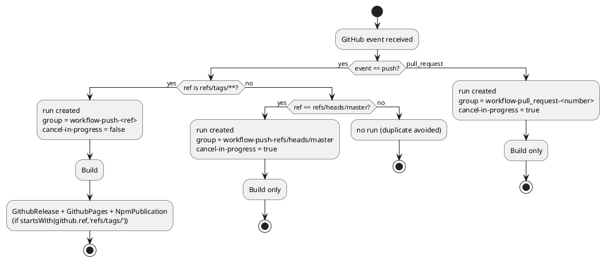

# CI/CD trigger scoping and run deduplication for GitHub Actions

# Summary

`.github/workflows/continuous-integration.yaml` currently triggers on
`on: [ push, pull_request ]` with no ref filter and no `concurrency` group. A
commit pushed to a branch that has an open pull request therefore fires two
events and runs the `Build` job twice, and a run already in progress is never
cancelled when a newer commit supersedes it. This design scopes the `push`
trigger so each commit is built once, adds workflow-level `concurrency` so a
superseded run is cancelled, and — the load-bearing part — keeps the
tag-triggered `GithubRelease`, `GithubPages` and `NpmPublication` jobs firing
exactly as they do today.

The release path is why this run is `hard_judgment` in the wave manifest:
GitHub's documented rule is that a `push` trigger carrying only a `branches:`
filter does **not** run for tag pushes. Adding the branch filter alone would
silently disable every npm publish, GitHub Pages deploy and GitHub Release.

# Scope

In scope:

- `.github/workflows/continuous-integration.yaml` — `on:` trigger filters and
  a new workflow-level `concurrency` block. Job bodies, step order, step
  contents and the three release jobs' `if:` conditions stay byte-identical.
- `.github/workflows/codeql-analysis.yml` — add `concurrency` only. Its
  triggers are already branch-filtered to `master` and need no change.
- `.github/workflows/copilot-setup-steps.yml` — the same duplicate-run defect
  as the CI workflow (`push` + `pull_request`, both path-filtered to the file
  itself, so editing it in a pull request runs the job twice); scope the
  `push` trigger and add `concurrency`.

Out of scope:

- `.github/workflows/package-builder.yaml` — `workflow_dispatch` only, so it
  has no duplicate-trigger defect; see `DEC-5` for why it deliberately gets
  no `concurrency` block either.
- Any change to what the jobs *do*: no new matrices, no step reordering, no
  cache-key changes, no runner-image changes, no `paths-ignore`-based
  skipping (see `DEF-1`).
- Branch protection / required-status-check configuration, which lives in
  GitHub repository settings rather than in this repository (and is currently
  absent entirely — `ASM-3`).

# PRD Traceability

**Traceability is incomplete: this run has no PRD.** Per `manage-runs`'
document profiles, run 0002 uses the `TDD+pln` profile — its scope arrived
settled from the wave manifest, so a PRD would only transcribe it. The
requirements below are therefore *sourced from the wave*, not assumed, and
are referenced by their wave identifiers:

| Source | Requirement | Addressed by |
|---|---|---|
| `wav-001` W-2 `focus` | Trigger CI automatically on push and PR with the minimum work per commit | `DEC-1`, `DEC-2`, `IMP-1` |
| `wav-001` W-2 exit evidence #1 | A push to a feature branch with an open PR runs `Build` exactly once for that commit | `DEC-1`, `FLOW-1` |
| `wav-001` W-2 exit evidence #2 | A second rapid push cancels the first run in progress | `DEC-2`, `FLOW-2` |
| `wav-001` W-2 exit evidence #3 | Tag pushes still trigger `GithubRelease`, `GithubPages`, `NpmPublication` | `DEC-3`, `FLOW-3`, `RISK-1` |
| `wav-001` Non-Goals | No new CI capabilities; scope is trigger conditions and minute economy on existing jobs only | Scope section, `DEF-1` |
| `wav-001` Phase P1 gate | `npm run lint` and `npm test` pass | Observability check 4 |
| `wav-001` Completion Criteria | CI runs automatically on every push and every pull request | `DEC-1`, with the narrowing argued there |

No wave requirement for W-2 is left unresolved. One is addressed with a
deliberate narrowing of the wave's "every push" wording, argued in `DEC-1`'s
Tradeoffs and reopenable via `DEF-4`.

# Technical Goals

- `TG-1` — Exactly one `Build` run **per commit** in the normal contribution
  flow (feature branch + open pull request).
- `TG-2` — A run superseded by a newer commit on the same branch or pull
  request is cancelled rather than run to completion.
- `TG-3` — The release path (tag push → `Build` → `GithubRelease` /
  `GithubPages` / `NpmPublication`) behaves identically to today, including
  never being cancelled by the new `concurrency` block.

# Non-Goals

- Reducing the *duration* of the `Build` job (cache tuning, test
  parallelisation, skipping steps).
- Skipping CI for documentation-only commits (`DEF-1`).
- Introducing reusable workflows or composite actions to deduplicate the
  repeated node-setup/cache step blocks across the four workflows (`DEF-2`).
- Pushing the branch or opening a pull request (`CON-4`).

# Assumptions

- `ASM-1` — The contribution flow for this repository is feature branch →
  pull request → merge to `master`; direct pushes to `master` happen but are
  the maintainer's own. *Validated by:* `git branch -a` shows `master` plus
  short-lived `copilot/*` branches; `origin/v1.x` (last commit 2020-11-05)
  and `origin/v3.x` (2021-05-11) are dormant.
- `ASM-2` — Release tags are produced by `standard-version` and are flat,
  `v`-prefixed names. *Validated by:* all 81 existing tags —
  `git tag --list | wc -l` → `81`, `grep -cv '^v'` → `0`, `grep -c '/'` → `0`.
  The design does not depend on this assumption holding in future
  (`DEC-3` uses `tags: [ '**' ]`).
- `ASM-3` — **Verified fact rather than assumption** (`Q-2`): no required
  status check exists. `gh api repos/tmorin/plantuml-libs/branches/master`
  returns `"protected": false` with
  `required_status_checks.enforcement_level: "off"` and empty
  `checks`/`contexts`; `gh api repos/tmorin/plantuml-libs/rulesets` returns
  `[]`. So no check, from any event, can block a merge.
- `ASM-4` — Pushes authored by `GITHUB_TOKEN` (the `gh-pages` deploy by
  `peaceiris/actions-gh-pages`, the `package-builder` commit by
  `ad-m/github-push-action`) do not create workflow runs, per GitHub's
  recursive-workflow prevention. *Consequence:* the branch filter removes no
  run on those refs — there was never one to remove.

# Constraints

- `CON-1` — GitHub Actions workflow syntax only; no third-party orchestration.
  A `push` trigger that declares `branches:` must also declare `tags:` to keep
  matching tag pushes (documented rule, quoted in the prg's Findings).
- `CON-2` — `concurrency` group and `cancel-in-progress` expressions may use
  only the `github`, `inputs` and `vars` contexts. No `secrets`, no `env`, no
  job outputs.
- `CON-3` — The repository declares no canonical registers and no backlog
  register: there is no `docs/CLAUDE.md`, no `docs/adr/`, no `docs/bkg/`, no
  `tooling/docs/check-backlog.py`, and `docs/` contains only `docs/wav/`. So
  no ADR constrains this design, there is no `arc`/`dom` register to keep
  current, and deferred items stay in this document. **Sole owner of this
  fact**; everything else in this TDD refers to `CON-3` rather than restating
  it.
- `CON-4` — Verification cannot include a real push: this run's dispatch
  reserves `git push` and pull-request creation for the human, and the
  repository's own publishing jobs make an experimental tag push unsafe.
  Verification is therefore static. **Sole owner of the "no push" rule.**
- `CON-5` — House style of `continuous-integration.yaml`: two-space indent and
  `[ a, b ]` flow sequences with inner spaces.

# Current State

Four workflows exist under `.github/workflows/`:

| File | Triggers today | Duplicate-run defect |
|---|---|---|
| `continuous-integration.yaml` | `on: [ push, pull_request ]` — no ref filter, no `concurrency` | **Yes** — any commit on a branch with an open PR builds twice; nothing cancels a superseded run |
| `codeql-analysis.yml` | `push`/`pull_request` filtered to `branches: [ master ]`, plus `schedule: '33 17 * * 1'` | No duplicate, but no `concurrency` either |
| `copilot-setup-steps.yml` | `workflow_dispatch`, plus `push`/`pull_request` filtered to `paths: [ .github/workflows/copilot-setup-steps.yml ]` | **Yes** — editing that one file in a PR runs the job twice |
| `package-builder.yaml` | `workflow_dispatch` only | No |

`continuous-integration.yaml` holds four jobs: `Build` (unconditional) and
`GithubRelease`, `GithubPages`, `NpmPublication`, each `needs: [ Build ]` and
each gated by `if: ${{ startsWith(github.ref, 'refs/tags/') }}`. The gate is a
job-level `if:`, not a trigger filter — which is precisely why the workflow
currently has to run on every push of every ref: the ref test happens after
the workflow has already been triggered.

# Proposed Design

Two independent mechanisms, each solving one defect, deliberately not
overlapped:

1. **Trigger-level deduplication** removes the duplicate `Build`. `push` is
   narrowed to `branches: [ master ]` **and** `tags: [ '**' ]`;
   `pull_request` is left unfiltered. A feature-branch commit with an open
   pull request now fires one event (`pull_request: synchronize`), so it
   builds once — by *not starting* a second run, rather than by starting and
   cancelling one.
2. **Concurrency-level supersession** cancels obsolete runs. A
   workflow-level `concurrency` block groups runs per workflow, per event
   kind and per branch-or-pull-request, with `cancel-in-progress` switched
   off for tag refs where tag refs can arrive.

`continuous-integration.yaml` — the only file whose triggers gate a release:

```yaml
on:
  push:
    branches: [ master ]
    tags: [ '**' ]
  pull_request:

concurrency:
  group: ${{ github.workflow }}-${{ github.event_name }}-${{ github.event.pull_request.number || github.ref }}
  cancel-in-progress: ${{ !startsWith(github.ref, 'refs/tags/') }}
```

`codeql-analysis.yml` — `concurrency` only, triggers untouched:

```yaml
concurrency:
  group: ${{ github.workflow }}-${{ github.event_name }}-${{ github.event.pull_request.number || github.ref }}
  cancel-in-progress: true
```

`copilot-setup-steps.yml` — `push` arm scoped to `master`, `concurrency`
added, and deliberately **no** `tags:` filter (`DEC-6`):

```yaml
on:
  workflow_dispatch:
  push:
    branches: [ master ]
    paths:
      - .github/workflows/copilot-setup-steps.yml
  pull_request:
    paths:
      - .github/workflows/copilot-setup-steps.yml

concurrency:
  group: ${{ github.workflow }}-${{ github.event_name }}-${{ github.event.pull_request.number || github.ref }}
  cancel-in-progress: true
```

The group expression is identical in all three files; `github.workflow`
namespaces it per workflow, which is what lets it be copied verbatim without
two workflows ever sharing a group (`DEC-2`). The plain
`cancel-in-progress: true` in the latter two is not an oversight: neither
workflow can be reached by a tag ref — `codeql-analysis.yml` filters `push`
to `branches: [ master ]`, and `copilot-setup-steps.yml` declares no `tags:`
— so a tag predicate there would be a dead branch (`DEC-4`).

Everything below each file's `jobs:` key is untouched.

- `DEC-1` — **Narrow the `push` trigger to `master` rather than cancel the
  duplicate run**
  - **Decision:** `push: branches: [ master ]`, `pull_request:` unfiltered.
    A commit on a feature branch is built by the `pull_request` event only.
  - **Rationale:** it satisfies "exactly once" by never creating the second
    run. The alternative creates it and kills it, which still bills the
    startup minutes and, worse, leaves a `cancelled` `Build` check on the
    pull request — indistinguishable at a glance from a failure. It also
    reuses the `push` branch filter `codeql-analysis.yml` already applies.
  - **Alternatives considered:** (a) keep both triggers unfiltered and let a
    commit-keyed `concurrency` group (`github.event.pull_request.head.sha ||
    github.sha`) collapse the pair — rejected: a *new* commit gets a new
    group, so superseded runs would no longer be cancelled, losing `TG-2`;
    (b) keep both triggers and key the group on
    `github.head_ref || github.ref_name` so push and pull-request runs of the
    same branch collide — rejected: it makes the two mechanisms share one
    control, and it cross-cancels whenever a fork's pull-request head branch
    is named `master` (a common case), which would destroy `master`'s own CI
    result; (c) mirror a `branches: [ master ]` filter onto `pull_request`
    too — rejected as a gratuitous narrowing, since a pull request targeting
    `v1.x`/`v3.x` should still be built.
  - **Tradeoffs:** two, both accepted deliberately. First, a commit pushed to
    a feature branch with **no** open pull request gets no CI at all; that is
    the intended minute economy, and feedback returns the moment a pull
    request is opened (`pull_request: opened` builds the head commit). This
    narrows the wave's "every push" wording to "`master`, every tag, and
    every pull request", which is the reading that makes the wave
    self-consistent — its own purpose asks for "the minimum work needed per
    commit" in the same sentence, and building an un-PR'd feature commit and
    then building it again as a pull-request commit is exactly the duplicate
    the wave exists to remove. `DEF-4` is the cheap reversal if the
    maintainer disagrees. Second, merging a pull request pushes a **new**
    commit to `master`, which is built once more; `TG-1` is per commit, not
    per tree, and that merge build is the largest remaining `Build` spend
    under this design — kept on purpose, since `master` is the branch
    releases are cut from.
  - **Linked IDs:** wave W-2 focus, exit evidence #1; `TG-1`; `Q-1`.

- `DEC-2` — **Workflow-level concurrency keyed by workflow, event kind and
  ref**
  - **Decision:** one workflow-level `concurrency` block;
    `group: ${{ github.workflow }}-${{ github.event_name }}-${{ github.event.pull_request.number || github.ref }}`.
  - **Rationale:** `github.workflow` namespaces the group per workflow, so the
    same expression can be reused verbatim in all three files without two
    workflows colliding. Including `github.event_name` guarantees a `push` run
    and a `pull_request` run can never land in the same group, so
    `concurrency` is responsible for supersession only and never silently
    deduplicates across event kinds — the two concerns stay separately
    diagnosable. Keying pull requests by `number` rather than by `head_ref`
    makes fork branch names irrelevant, removing the `master`-named-fork-branch
    collision that killed alternative (b) in `DEC-1`. `github.ref` keys push
    runs, which is unique per branch and per tag.
  - **Alternatives considered:** per-job `concurrency` blocks (more verbose,
    and would let `Build` be cancelled while a release job survives);
    `github.head_ref || github.run_id` from GitHub's own example (`run_id` is
    unique per run, so push runs would never cancel each other — loses `TG-2`
    on `master`).
  - **Tradeoffs:** in the one edge case where `master` is itself the head
    branch of an open pull request, that commit still builds twice, since the
    groups differ by `event_name`. Accepted knowingly: a rare duplicate costs
    minutes, whereas cross-event cancellation can destroy a wanted result.
  - **Linked IDs:** wave W-2 exit evidence #2; `TG-2`.

- `DEC-3` — **`tags: [ '**' ]` on the push trigger, not `v*`**
  - **Decision:** declare `tags: [ '**' ]` alongside the `branches:` filter in
    `continuous-integration.yaml`.
  - **Rationale:** the `branches:`-only rule (`CON-1`) would stop tag pushes
    from triggering the workflow at all, taking the three release jobs with
    them. `'**'` matches every tag including hierarchical names, making the new
    trigger a strict superset of today's "every tag triggers" behaviour. The
    release path then cannot be broken by a future edit to the *branch*
    filter, which is the failure mode this run exists to avoid.
  - **Alternatives considered:** `tags: [ 'v*' ]` — correct for every existing
    tag (`ASM-2`) but it would make the release path depend on a naming
    convention that nothing enforces; `tags: [ '*' ]` — does not match a tag
    containing `/`.
  - **Tradeoffs:** a stray non-release tag push triggers a full `Build` plus
    the release jobs. That is exactly today's behaviour, so it is a preserved
    quirk rather than a new one.
  - **Linked IDs:** wave W-2 exit evidence #3; `TG-3`, `RISK-1`.

- `DEC-4` — **`cancel-in-progress` disabled for tag refs, and only where tag
  refs can arrive**
  - **Decision:** `cancel-in-progress: ${{ !startsWith(github.ref,
    'refs/tags/') }}` in `continuous-integration.yaml`; plain `true` in the
    other two files.
  - **Rationale:** defence in depth for the publishing path. With `DEC-2`'s
    group key a tag run already cannot share a group with a branch run; this
    makes that structural rather than incidental, so a later change to the
    group expression cannot introduce a cancelled half-published release (npm
    published, Pages not deployed). It reuses the same
    `startsWith(github.ref, 'refs/tags/')` predicate the three release jobs
    already use, so the file has one notion of "this is a release run". The
    other two workflows get plain `true` because no tag ref can reach them,
    and a guard that can never fire is harder to read than no guard.
  - **Alternatives considered:** plain `cancel-in-progress: true` everywhere
    (simpler, but leaves the release path protected only by the group key);
    the guarded expression everywhere (symmetry at the cost of two dead
    predicates); `cancel-in-progress: false` (abandons `TG-2`).
  - **Tradeoffs:** two tag pushes in flight at once both run to completion.
    Correct — each publishes a distinct version.
  - **Linked IDs:** `TG-2`, `TG-3`, `RISK-2`.

- `DEC-5` — **`package-builder.yaml` is left unchanged**
  - **Decision:** no trigger change and no `concurrency` block.
  - **Rationale:** it is `workflow_dispatch`-only, so it has no duplicate-run
    defect to fix. Its `push-distribution` job commits generated distribution
    files and pushes them with `ad-m/github-push-action`; cancelling that job
    mid-flight could leave a partially-staged commit or an interrupted push,
    so supersession is actively undesirable here. An un-cancellable manual
    workflow is the correct shape.
  - **Alternatives considered:** `concurrency` with `cancel-in-progress:
    false` to serialise two concurrent manual builds of the same package —
    plausible, but it changes queueing behaviour for a human-triggered
    workflow without a reported problem. Deferred (`DEF-3`).
  - **Linked IDs:** wave Non-Goals ("no new CI capabilities").

- `DEC-6` — **Only `continuous-integration.yaml` gets a `tags:` filter**
  - **Decision:** `copilot-setup-steps.yml` gets `branches: [ master ]` and
    deliberately **no** `tags:`, so tag pushes no longer trigger it.
  - **Rationale:** `tags:` exists in `DEC-3` for exactly one reason — to keep
    the release jobs reachable — and only `continuous-integration.yaml` has
    release jobs. Mirroring it onto `copilot-setup-steps.yml` would run that
    workflow on every release tag and *add* minutes, inverting this run's
    purpose. The change is therefore a deliberate, small behaviour change on
    that file rather than pure preservation: whatever it does today on a tag
    push, after this it does nothing, which is both cheaper and
    deterministic.
  - **Alternatives considered:** mirror `tags: [ '**' ]` for symmetry across
    the workflow files — rejected, symmetry here would be a cost with no
    beneficiary, and it would make a setup-validation job part of every
    release; drop the `paths:` filter and rely on branches alone — rejected,
    it would run the setup job on every `master` push.
  - **Tradeoffs:** if someone edits `copilot-setup-steps.yml` and ships that
    edit only via a tag push (no branch push, no pull request), it is not
    validated. `workflow_dispatch` is retained precisely for that case.
    Related unverified point, deliberately *not* relied on: whether GitHub
    evaluates a `paths:` filter at all for a tag push (`Q-3`). This decision
    holds either way — if paths are ignored on tag pushes the current file
    runs on every release and removing `tags:` is a saving; if they are
    honoured, removing `tags:` changes nothing in practice.
  - **Linked IDs:** `IMP-3`, `CTR-2`, wave Non-Goals.

# Repository Impact

Besides the three workflow files below, this run writes its own documents
under
`docs/wav/wav-001-dependency-ci-refresh/run/run-0002-ci-cd-minute-optimization/`
— additive, and outside the wave manifest's `likely_paths`
(`.github/workflows/**`), so it is named in the run's final report.

- `IMP-1` — **Continuous Integration workflow triggers**
  - **Path(s):** `.github/workflows/continuous-integration.yaml`
  - **Change type:** modify (trigger configuration), additive
    (`concurrency` block)
  - **Why impacted:** it holds the duplicate-trigger defect and the missing
    `concurrency` group. Replaces `on: [ push, pull_request ]` with the
    filtered mapping form and adds a workflow-level `concurrency` block
    between `on:` and `jobs:`.
  - **Linked IDs:** `DEC-1`, `DEC-2`, `DEC-3`, `DEC-4`
  - **Risks / notes:** the production-impact file. The four job definitions,
    including the three `if: ${{ startsWith(github.ref, 'refs/tags/') }}`
    gates, must come out of the diff untouched — asserted mechanically in
    the Observability section.

- `IMP-2` — **CodeQL workflow concurrency**
  - **Path(s):** `.github/workflows/codeql-analysis.yml`
  - **Change type:** additive
  - **Why impacted:** minute economy on an existing job. Triggers already
    branch-filtered, so only the `concurrency` block is added; the weekly
    `schedule` run keys into its own group via `github.event_name`.
  - **Linked IDs:** `DEC-2`, `DEC-4`
  - **Risks / notes:** cancelling a superseded CodeQL run leaves the previous
    completed analysis as the latest security result, which is the intended
    behaviour. No publishing involvement.

- `IMP-3` — **Copilot setup-steps workflow triggers**
  - **Path(s):** `.github/workflows/copilot-setup-steps.yml`
  - **Change type:** modify (trigger configuration), additive
    (`concurrency` block)
  - **Why impacted:** same duplicate-run defect as `IMP-1`, one job instead of
    four. Adds `branches: [ master ]` beside the existing `paths:` filter on
    `push` (the two filters are ANDed, so the job still only runs when that
    file itself changes), and adds `concurrency`.
  - **Linked IDs:** `DEC-1`, `DEC-2`, `DEC-6`
  - **Risks / notes:** **no `tags:` filter here** — `DEC-6`. `workflow_dispatch`
    must stay, since manual validation is this workflow's documented purpose.
    A `workflow_dispatch` run keys into its own concurrency group via
    `github.event_name`.

# Canonical Impact

- `CI-arc-1` — **None** (`CON-3`: no `arc` register declared).
- `CI-dom-1` — **None** (`CON-3`: no `dom` register declared, and this run
  ratifies no domain invariant).

The nearest thing to an invariant this run establishes — "a release tag always
triggers the release jobs" — is enforced by the `tags: [ '**' ]` filter in
`.github/workflows/continuous-integration.yaml` and asserted by this run's
verification script, but it has no register packet to move to `ratified`.

# Data Model and Contracts

- `CTR-1` — **Continuous Integration trigger contract**
  - **Current contract:** the workflow runs for every `push` of every ref and
    every `pull_request` activity. Release jobs self-select at job level with
    `if: ${{ startsWith(github.ref, 'refs/tags/') }}`.
  - **Proposed contract:** the workflow runs for a `push` to `master`, a
    `push` of any tag, and every `pull_request` activity (default types:
    `opened`, `synchronize`, `reopened`). Release-job selection is unchanged
    and still happens at job level. Concurrency: at most one live run per
    (workflow, event kind, pull-request number or ref); a newer run cancels an
    older one unless the ref is a tag.
  - **Affected files:** `.github/workflows/continuous-integration.yaml`
  - **Migration or compatibility notes:** no consumer reads this contract
    programmatically. The one external coupling would be GitHub branch
    protection's required-status-check list, and there is none — `master` is
    unprotected with no rulesets (`ASM-3`). `Build` continues to report on
    every pull request regardless.
  - **Linked IDs:** wave W-2 exit evidence #1-#3

- `CTR-2` — **Copilot setup-steps trigger contract**
  - **Current contract:** runs on `workflow_dispatch`, and on
    `push`/`pull_request` whose changed paths include
    `.github/workflows/copilot-setup-steps.yml`.
  - **Proposed contract:** unchanged except that the `push` arm additionally
    requires the ref to be `master`. Tag pushes stop triggering it, which is
    intended (`DEC-6`). The `pull_request` arm and `workflow_dispatch` are
    untouched.
  - **Affected files:** `.github/workflows/copilot-setup-steps.yml`
  - **Migration or compatibility notes:** the file's own header comment
    ("Automatically run the setup steps when they are changed to allow for
    easy validation") still holds — validation now arrives via the pull
    request rather than twice.
  - **Linked IDs:** `IMP-3`

No data structure, API, message format or generated-file format changes:
nothing under `source/`, `bin/`, `test/` or `distribution/` is touched.

# Interfaces and Behavior

- `IF-1` — **GitHub Actions event interface (inbound).** Inputs: `push`
  (ref), `pull_request` (activity type, number, head sha),
  `workflow_dispatch`, `schedule`. Output: zero or one workflow run per
  event. The change is entirely in which events are accepted.
- `IF-2` — **Pull-request checks surface (outbound).** A pull request shows one
  `Build` check instead of two (`Build` from `push` + `Build` from
  `pull_request`). Error states: a cancelled run reports as `cancelled`, not
  `failure` — under `DEC-1` this now only happens to a run genuinely
  superseded by a newer commit, not to a redundant twin.
- `IF-3` — **Release surface (outbound), unchanged.** On a tag push: a GitHub
  Release carrying `tmorin-plantuml-libs.zip`, a `gh-pages` deployment, and an
  `@tmorin/plantuml-libs` npm publish. No step, secret or permission in those
  three jobs is modified.

# Flows and Processing Logic

- `FLOW-1` — **Feature-branch commit with an open pull request**
  - **Trigger:** `git push` of commit `C` to `feature/x`, pull request #N open
    from `feature/x`.
  - **Steps:** `push` event evaluated → ref `refs/heads/feature/x` matches
    neither `branches: [ master ]` nor `tags: [ '**' ]` → **no run**.
    `pull_request: synchronize` for #N → run created, group
    `Continuous Integration-pull_request-N` → `Build` executes once.
  - **Branches / failure paths:** no open pull request → no run at all
    (`DEC-1` tradeoff). Opening the pull request later fires
    `pull_request: opened` and builds `C` then.
  - **Final output:** one `Build` check on #N; the three release jobs are
    skipped by their existing `if:` gate.
  - **Linked IDs:** wave W-2 exit evidence #1

- `FLOW-2` — **Rapid second push**
  - **Trigger:** commit `C2` pushed to `feature/x` while #N's run for `C1` is
    in progress.
  - **Steps:** `pull_request: synchronize` → new run, same group
    `…-pull_request-N` → `cancel-in-progress` evaluates
    `!startsWith('refs/pull/N/merge', 'refs/tags/')` → `true` → the `C1` run is
    cancelled, the `C2` run proceeds.
  - **Branches / failure paths:** the same applies to consecutive pushes to
    `master`, grouped as `…-push-refs/heads/master`.
  - **Final output:** one completed `Build` for `C2`; the `C1` run ends
    `cancelled`.
  - **Linked IDs:** wave W-2 exit evidence #2

- `FLOW-3` — **Release tag push (must be unchanged)**
  - **Trigger:** `git push origin v18.3.0` (as produced by `npm run release`).
  - **Steps:** `push` event, ref `refs/tags/v18.3.0` → matches
    `tags: [ '**' ]` → run created, group
    `…-push-refs/tags/v18.3.0`, `cancel-in-progress` evaluates to `false` →
    `Build` runs and uploads `artifacts` → `GithubRelease`, `GithubPages` and
    `NpmPublication` each pass `startsWith(github.ref, 'refs/tags/')` and run.
  - **Branches / failure paths:** `Build` fails → all three release jobs are
    skipped by `needs: [ Build ]`, exactly as today. A concurrent `master`
    push cannot cancel this run (different group *and* `cancel-in-progress`
    false).
  - **Final output:** GitHub Release + `gh-pages` deployment + npm publish,
    identical to current behaviour.
  - **Linked IDs:** wave W-2 exit evidence #3, `RISK-1`



Validate two things against the diagram: the tag path is the only one that
reaches the three release jobs, and it is the only one whose
`cancel-in-progress` is false.

# Reliability, Performance, and Scalability

Minute economy is the point: in the normal flow this halves the `Build` runs
per pull-request commit, and supersession cancellation removes the tail of
runs nobody will read. Reliability risk concentrates entirely in the release
path, handled by `DEC-3` (tags explicitly matched) and `DEC-4` (tag runs never
cancelled). No job body, timeout or runner changes, so per-run performance is
unaffected. Maintainability: the duplicated node-setup/cache blocks across
the four workflows remain duplicated — real, out of scope, `DEF-2`.

# Security and Privacy

No change to `permissions:` blocks, to secret usage (`GITHUB_TOKEN`,
`GOOGLE_TAG_ID`, npm OIDC via `id-token: write`), or to which refs can reach
them. One security-relevant property is preserved by construction: the
`pull_request` trigger (not `pull_request_target`) is kept, so a fork's pull
request still runs without access to repository secrets. Narrowing `push` to
`master` + tags additionally means a fork-branch push can no longer start a
run in this repository's context at all. `codeql-analysis.yml` keeps its
`security-events: write` permission and weekly schedule; because
`github.event_name` is part of the group key, a `schedule` run shares a group
only with another `schedule` run, which the weekly cron (`'33 17 * * 1'`)
makes impossible in practice.

# Observability and Verification

Verification is static (`CON-4`). Four checks, all runnable locally:

1. **YAML validity** — `python3 -c "import yaml,sys; [yaml.safe_load(open(f))
   for f in sys.argv[1:]]"` over the three edited files. Catches indentation
   errors, the classic way a trigger block silently changes meaning. Note the
   YAML gotcha every later check depends on: in `on:`, the key `on` parses as
   the boolean `True` under YAML 1.1, so the parsed mapping must be read with
   a key lookup that accounts for it.

2. **Trigger-semantics assertions** — a throwaway Python script (session
   scratchpad, not committed) that loads all four workflow files and asserts,
   per file, which facts changed and which must *not* have:

   | File | `push.branches` | `push.tags` | `pull_request` | `concurrency` |
   |---|---|---|---|---|
   | `continuous-integration.yaml` | `['master']` (new) | `['**']` (new) | key present, **no** `branches` key (new) | `group` contains `github.event_name` and `github.event.pull_request.number`; `cancel-in-progress` negates `startsWith(github.ref, 'refs/tags/')` |
   | `codeql-analysis.yml` | `['master']` (**unchanged**) | **absent** (unchanged) | `branches == ['master']` (**unchanged**) | `group` present; `cancel-in-progress: true` |
   | `copilot-setup-steps.yml` | `['master']` (new) | **absent** (`DEC-6`, asserted negatively) | `paths` filter **unchanged**, no `branches` key | `group` present; `cancel-in-progress: true` |
   | `package-builder.yaml` | n/a — `workflow_dispatch` only (**unchanged**) | n/a | n/a | **absent** (`DEC-5`, asserted negatively) |

   Plus the release assertions, on `continuous-integration.yaml` only: all
   three of `GithubRelease`, `GithubPages`, `NpmPublication` still carry
   `needs: [ Build ]` and `if: ${{ startsWith(github.ref, 'refs/tags/') }}`,
   `Build` is still unconditional, and a concrete tag ref (`v18.3.0`, and a
   hierarchical `release/18.3.0`) still matches the `push` tag filter while a
   feature-branch ref does not match the branch filter.

3. **Diff containment** — `git diff -- .github/workflows/` reviewed line by
   line, asserting that in `continuous-integration.yaml` every changed line
   lies above `jobs:`. This is the strongest available evidence for exit
   criterion #3: if no release-job line changed, release behaviour can only
   change through the trigger, which check 2 pins.

4. **Repository regression** — `npm run lint` and `npm test`. These are the
   wave's own Phase P1 gate criteria, so they must be demonstrated green on
   this run's tree regardless of this change's reach; they also detect
   collateral damage against the pre-change baseline captured at
   `5ec73b75a6` (lint exit 0; `npm test` exit 0, 5 passing). `npm test` makes
   real network requests (per `CLAUDE.md`) and is the slow check here.

# Deployment and Rollout

Config-only change, confined to `.github/workflows/`. No build artefact, no
data migration, no dependency change.

Because the `pull_request` event "runs in the context of the merge commit"
(GitHub's `pull_request_target` reference states that event "runs in the
context of the default branch of the base repository, rather than in the
context of the merge commit, as the `pull_request` event does"), a pull
request carrying this change exercises the **new** triggers and the new
`concurrency` on itself. So `FLOW-1` and `FLOW-2` get a real observation
before anything merges — the rollout is better than static verification
alone, which is why the human's pull request is the right next step
(`CON-4`). `push` triggers take effect from the pushed ref once merged.

Staging is otherwise unavailable — there is no second repository to rehearse
against, and a rehearsal tag push would publish to npm, so `FLOW-3` is first
observed at the next real release.

Rollback: `git revert` of the single commit restores `on: [ push,
pull_request ]`; nothing persists state, so the previous behaviour returns
with the next event.

# Risks and Tradeoffs

- `RISK-1` — **Release path silently disabled (severity: critical).** A
  `branches:`-only `push` filter stops matching tag pushes, so
  `GithubRelease`/`GithubPages`/`NpmPublication` would never fire and nothing
  would fail loudly — the next `npm run release` would appear to succeed
  locally and publish nothing. *Mitigation:* `DEC-3` (`tags: [ '**' ]`) plus
  verification check 2's explicit tag assertions and check 3's diff
  containment. This is the risk the wave cited for W-2's `hard_judgment`
  tier, and the reason the trigger edit is executed inline rather than
  delegated.
- `RISK-2` — **Half-published release from a cancelled tag run (severity:
  high).** `concurrency` + `cancel-in-progress` could abort a tag run between
  `NpmPublication` and `GithubPages`, leaving npm ahead of the site.
  *Mitigation:* `DEC-4` makes `cancel-in-progress` false for tag refs, and
  `DEC-2`'s group key keeps tag runs in their own group.
- `RISK-3` — **A required status check bound to the push-event `Build`
  (severity: nil — retired).** Would have stalled pull requests on a check
  that no longer reports. *Retired by evidence, not by mitigation:* `Q-2`
  established that `master` has no branch protection and the repository has
  no rulesets, so no check is required from any event. Kept in the list
  because it was a real pre-verification risk and a reader should see how it
  was discharged; it becomes live again the day branch protection is enabled,
  at which point the required check must be the `pull_request` `Build`.
- `RISK-4` — **Lost CI on un-PR'd branches (severity: low, accepted).** A
  maintainer pushing a long-lived branch without opening a pull request gets
  no feedback. Accepted as the intended economy (`DEC-1`); `workflow_dispatch`
  is not currently available on the CI workflow as an escape hatch (`DEF-4`).
- `RISK-5` — **Static verification cannot prove GitHub's evaluation
  (severity: medium, residual).** The assertions prove the file says what
  this design intends; they cannot prove GitHub's trigger evaluator agrees.
  Documented behaviour (fetched and quoted in the prg) is the only available
  substitute inside this run; the human's pull request supplies the first
  real observation of `FLOW-1`/`FLOW-2`, and the next release of `FLOW-3`.

# Open Questions

- `Q-1` — **Does narrowing "every push" to "`master` + tags + every pull
  request" satisfy the wave?** Resolved in `DEC-1`'s Tradeoffs, by reading the
  wave's own exit evidence and purpose together rather than its wording
  alone. Recorded rather than deleted so a maintainer who wants CI on every
  branch push can reopen it; `DEF-4` is the cheap answer.
- `Q-2` — **Is any GitHub branch-protection required status check bound to a
  `Build` run from the `push` event?** **Resolved: no — there is no branch
  protection and no ruleset.** The plugin's `github` MCP server is
  unauthenticated in this session, but the `gh` CLI is authenticated as
  `tmorin` with `repo` scope, so this was answered against the live
  repository rather than assumed: `gh api
  repos/tmorin/plantuml-libs/branches/master/protection` → HTTP 404 "Branch
  not protected"; `gh api repos/tmorin/plantuml-libs/branches/master --jq
  '{protected,protection}'` → `{"protected": false, "protection":
  {"enabled": false, "required_status_checks": {"checks": [], "contexts":
  [], "enforcement_level": "off"}}}`; `gh api
  repos/tmorin/plantuml-libs/rulesets` → `[]`. *Consequence:* `RISK-3`
  collapses to nil and `DEF-1`'s blocker is removed. Both read-only API
  calls; nothing in the repository's settings was changed.
- `Q-3` — **Does GitHub evaluate a `paths:` filter for a tag push?**
  **Unresolved, and deliberately not depended on.** GitHub's events reference
  documents `paths` filters in terms of changed files, and a tag push has no
  reliable before/after pair to diff, but the page states no explicit rule —
  so this TDD does not assert one. `DEC-6` is argued to hold under either
  answer, which is why this stays an open question instead of becoming a
  blocker.

# Deferred Work

- `DEF-1` — **Path-based CI skipping.** A `paths-ignore` filter for
  documentation-only commits (`docs/**`, `**.md`) would save further minutes.
  Its blocker is gone — `Q-2` showed no `Build` check is required, so an
  ignored commit reporting no check cannot stall a merge today. Still
  deferred on scope grounds: it is a new trigger condition beyond W-2's exit
  evidence, it needs a path list that is argued rather than guessed (is
  `scripts/**` docs or build?), and it becomes a merge-blocking hazard the
  moment branch protection is enabled (`RISK-3`). Worth its own run.
- `DEF-2` — **Factor the repeated node-setup/cache step block** (identical
  across all four workflows) into a composite action or reusable workflow.
  Pure maintainability; outside "trigger conditions and minute economy".
- `DEF-3` — **`concurrency` for `package-builder.yaml`** with
  `cancel-in-progress: false`, to serialise two manual builds of the same
  package rather than let them race on the same branch (`DEC-5`).
- `DEF-4` — **Add `workflow_dispatch` to `continuous-integration.yaml`** so a
  branch without a pull request can still be built on demand — the cheap
  answer to `RISK-4` and to `Q-1`. Not added here because it is a new trigger
  surface on the workflow that holds the publishing jobs, and a
  `workflow_dispatch` run on a tag ref would reach them.
- `DEF-5` — **Adopt `actionlint`** for these workflow files, in CI or as a
  pre-commit hook. It is the natural fifth verification check and is not
  installed in this environment; installing a Go binary for one run would
  exceed the wave's "no new CI capabilities" non-goal, and whether the
  repository wants a standing lint for workflows is a decision for the
  repository, not for this run.

These stay in this document rather than becoming backlog entries, per
`CON-3`.

# File Placement and Frontmatter

Saved as
`docs/wav/wav-001-dependency-ci-refresh/run/run-0002-ci-cd-minute-optimization/tdd-0002-ci-cd-minute-optimization.md`,
matching the wave-owned run layout already used by
`run-0002-ci-cd-minute-optimization.md` in the same directory. `docs/` holds
only `docs/wav/` today, so there is no competing convention. Frontmatter
carries `title`, `status`, `owner`, `date`, `type: tdd`, `run: 0002`,
`wave: 001`, and `related` (wave plan, business case, and this run's `run`,
`pln` and `prg` files).
