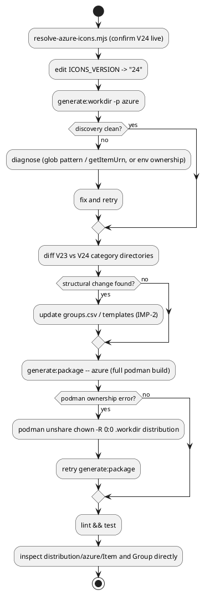

# Title

Azure icons refresh for `@tmorin/plantuml-libs` (wave 001, run W-4)

# Summary

Move the Azure package's pinned upstream icon set from V23 to V24 by
updating `ICONS_VERSION` in `source/library/packages/azure/index.ts`,
following the repository's own `.claude/skills/azure-package-upgrading`
skill — but adapted to this run's constraints: no branch push, no PR, no
GitHub Actions dispatch. No PRD exists for this run — **traceability is
incomplete**; requirements below are sourced directly from the wave
manifest (`docs/wav/wav-001-dependency-ci-refresh/wav-001-dependency-ci-refresh.md`,
run `W-4`) and its business case, per this run's `TDD+pln` document profile
(infra-only work, scope and target version already settled by the wave).

# Scope

In scope: `source/library/packages/azure/index.ts` (`ICONS_VERSION` bump),
reviewing `source/library/packages/azure/groups.csv` and
`source/templates/azure/**` for structural breakage caused by the version
bump, and local end-to-end verification (`npm run generate:workdir`,
`npm run generate:package -- azure`, `npm run lint`, `npm test`).

Out of scope: npm dependency versions (wave run W-1, already `completed`),
any other icon/shape package (W-3, W-5, W-6, W-7), CI/CD workflow changes
(W-2), creating a feature branch, pushing, opening a pull request, or
dispatching the `package-builder.yaml` GitHub Actions workflow — this run's
dispatch brief explicitly forbids push/PR, so the howto's steps 2 and 5-9
(branch creation, commit+push, Actions dispatch, pull, PR) are replaced by
a local-only equivalent (`DEC-1` below).

# PRD Traceability

No PRD exists for this run (`TDD+pln` profile). Requirements are sourced
directly from:

- Wave manifest `W-4` entry: "use `azure-package-upgrading` to move the
  Azure icon set from V23 to the confirmed-available V24."
- Wave manifest P2 exit evidence: "Package rebuilds via `npm run
  generate:package -- -p azure`; pinned version is V24."
- Business case Context section: "Azure: `Azure_Public_Service_Icons_V24.zip`
  already resolves (HTTP 200) against the pinned V23 — a newer release
  exists."

All three are addressed by this TDD; none are unresolved.

# Technical Goals

- `TG-1` — `ICONS_VERSION` in `source/library/packages/azure/index.ts` is
  `"24"`, and `ICONS_URL` resolves to
  `Azure_Public_Service_Icons_V24.zip` (derived from `ICONS_VERSION`, no
  separate literal to keep in sync).
- `TG-2` — `npm run generate:workdir -- -p azure` succeeds against the new
  version, discovering icons and groups with no errors.
- `TG-3` — The full containerized build (`npm run generate:package --
  azure`) succeeds end to end, producing rendered `.puml`/`.png`/`.md`
  output under `distribution/azure/Item` and `distribution/azure/Group`
  with no loss of previously-working content.
- `TG-4` — `npm run lint` and `npm test` both pass against the final state.
- `TG-5` — Any icon-count or directory-structure change between V23 and V24
  is recorded (not silently absorbed) — if the glob pattern or
  `getItemUrn()` parsing in `index.ts` needs adjustment to match a
  structural change, that adjustment is made; if no structural change
  exists, that is recorded too.

# Non-Goals

- Does not touch `package.json`/`package-lock.json` (W-1's scope, already
  `completed`).
- Does not touch any other package under `source/library/packages/**`
  (W-3, W-5, W-6, W-7's scope).
- Does not touch `.github/workflows/**` (W-2's scope).
- Does not create a git branch, push, open a pull request, or trigger the
  `package-builder.yaml` workflow — explicitly forbidden by this run's
  dispatch brief, which asks for a local commit only.
- Does not change `groups.csv`'s custom groupings or `source/templates/azure/**`
  templates unless V24's directory structure actually requires it (`TG-5`
  decides this empirically, not speculatively).

# Assumptions

- `ASM-1` — V24 is genuinely the latest available Azure icon package at
  execution time, not merely at wave-authoring time (2026-10-04 for both,
  but registries/CDNs can change within a day). Validated by re-running
  `node scripts/resolve-azure-icons.mjs` (live HTTP fetch + HTML parse
  against `learn.microsoft.com`) at Stage 10 start, not trusting the wave's
  snapshot. Confirmed: resolves V24 live.
- `ASM-2` — Podman is available and functional in this execution
  environment, unlike a sibling icon-package run's environment (per the
  dispatch brief's warning). Validated empirically: `podman info` succeeds,
  and the `docker.io/thibaultmorin/plantuml-generator:1` image is already
  present locally — so this run performs full local verification rather
  than the documentation-only fallback the brief anticipated as a
  possibility.
- `ASM-3` — V24's internal directory/category structure is unchanged from
  V23 (same 29 top-level category folders under `Icons/`), so no change to
  `discover()`'s glob pattern or `getItemUrn()`'s path-parsing logic in
  `index.ts` is required. Validated empirically by extracting both V23 and
  V24 and diffing the top-level category directory listing (see Current
  State) before deciding `TG-5`'s outcome.
- `ASM-4` — The repository's rootless-Podman `--userns=keep-id -v ...:z,U`
  volume mounts can leave host-side files owned by the container's
  namespace-mapped UID after a run, requiring `podman unshare chown -R 0:0
  <path>` between a `ts-node`-driven `generate:workdir` step and a
  subsequent container run (or vice versa) in this specific environment.
  Validated empirically: `generate:workdir` failed with `EACCES` after a
  prior container run until this chown was applied; recorded as `RISK-4`
  rather than treated as a one-off fluke, since it reproduced twice.

# Constraints

- `CON-1` — Must follow `.claude/skills/azure-package-upgrading` and its
  referenced `doc/howto.upgrade-azure-package.md`, adapted per `DEC-1`
  where that howto assumes GitHub MCP/`gh`/Actions access this run's
  dispatch brief does not grant.
- `CON-2` — No semicolons, double-quote strings (Prettier + ESLint flat
  config) — the one-line `ICONS_VERSION` edit already matches this style;
  no other source edit is anticipated unless `TG-5` finds a structural
  change.
- `CON-3` — Do not modify `.workdir/`, `distribution/`, or `public/` by
  hand — only through the generator scripts (`doc/howto.upgrade-azure-package.md`
  Notes section, consistent with `CLAUDE.md`'s architecture description).
- `CON-4` — No push, no PR, no workflow dispatch (dispatch brief).

# Current State

- `source/library/packages/azure/index.ts` line 16: `const ICONS_VERSION =
  "23"`; line 17 derives `ICONS_URL` from it — a single literal to change,
  no second hardcoded version string elsewhere in the file (confirmed by
  reading the full file).
- `source/library/packages/azure/groups.csv`: 7 custom group rows, one of
  which (`Network`) references `azure/Item/Networking/ServiceVirtualNetworks`
  — a URN derived from the icon discovery path, not a literal file path, so
  it is only at risk if V24 renames or removes that specific icon.
- V23 baseline (generated before any change in this run): 705 discovered
  SVGs, 7 groups, 29 top-level category directories under
  `Icons/` (`ai + machine learning`, `analytics`, ... `web`).
- V24 (generated after the `ICONS_VERSION` edit): 714 discovered SVGs
  (+9), 7 groups (unchanged), the same 29 top-level category directories —
  confirmed via a direct `find -maxdepth 1 -type d` diff between the two
  extracted archives. `unifyItems()`'s URN-collision dedup reduces 714 raw
  SVGs to 709 unique item URNs in the generated `library.yaml` (5
  collisions) — this existed as a structural property of `unifyItems()`
  before this run and is not introduced by the version bump; recorded as a
  finding, not a defect this run owns.
- `azure/Item/Networking/ServiceVirtualNetworks` (the one
  `groups.csv`-referenced URN) still resolves correctly in the V24-derived
  `library.yaml` — confirmed by direct grep.
- `node scripts/resolve-azure-icons.mjs` (live) resolves
  `Azure_Public_Service_Icons_V24.zip`; `curl -I` against both the V23 and
  V24 URLs returns HTTP 200 (V23 is not yet retired upstream, consistent
  with Azure publishing N and N-1 side by side).
- `test/resolve-azure-icons.spec.mjs` mocks the HTML fetch via a static
  fixture (`test/fixtures/azure-valid.html`) and asserts the parser
  extracts `newVersion: "23"` from that fixture — this test exercises the
  HTML-parsing logic against a frozen snapshot of the Microsoft page as it
  looked when V23 was current, independent of live upstream state. It does
  not need to change for this run: the fixture is a historical parsing
  fixture, not a currency check, and the wave manifest's own `likely_paths`
  lists this file only because it is the one test file under this
  package's test surface, not because the upgrade requires editing it.
- Podman (`/usr/bin/podman`) and the `docker.io/thibaultmorin/plantuml-generator:1`
  image are present and functional in this execution environment —
  `scripts/generate-package.sh`/`npm run generate:package` are fully
  runnable here, unlike the Podman-unavailable environment a sibling run's
  dispatch brief anticipated as a possibility for this wave.
- `DEF-1` (full detail in Deferred Work): `CLAUDE.md`'s documented
  invocation `npm run generate:package -- -p <package>` passes an extra
  `-p` that `scripts/generate-package.sh` does not expect (it takes the
  bare package name as `$1`), so the correct invocation is `npm run
  generate:package -- azure`. Outside this run's `likely_paths` to fix.

# Proposed Design

Follow `.claude/skills/azure-package-upgrading`'s referenced howto
(`doc/howto.upgrade-azure-package.md`) for the parts that describe *what*
changes in the source tree, and substitute a local-only equivalent for the
parts that assume GitHub MCP/`gh`/Actions access this run does not have.
No new component, service, or architecture is introduced — this is a
version-pin change to an existing factory class, with no new relationship
between modules, so no component/class diagram applies.

`DEC-1` — Replace the howto's branch/push/Actions-dispatch/PR steps
(2, 5-9) with a local build-and-verify loop, since this run's dispatch
brief forbids push and PR creation.

- Decision: Stay on the current branch (`chore/upgrade-deps-and-ci-wave`,
  already the active branch per git status), make the `ICONS_VERSION` edit
  directly, validate locally via `npm run generate:workdir -- -p azure`
  then the full containerized `npm run generate:package -- azure` (using
  the corrected invocation from Current State, not the documented-but-buggy
  `-- -p azure` form), then `npm run lint`/`npm test`, then commit locally.
  No branch, no push, no PR, no `package-builder.yaml` dispatch.
- Rationale: the howto's GitHub-pipeline path exists for this
  repository's normal human-reviewed workflow; this run's dispatch brief
  explicitly overrides that with "commit locally if you reach that point,
  but leave pushing/PR-creation to the human" — identical in spirit to how
  run W-1 handled the same instruction for the npm-dependency upgrade.
- Alternatives considered: (a) follow the howto literally and stop short of
  push/PR, leaving verification only to the GitHub Actions
  `package-builder.yaml` pipeline — rejected, that pipeline cannot run
  without a push, and this run's Podman access makes a fully local
  equivalent possible and strictly stronger evidence; (b) skip the
  containerized build entirely and rely on `generate:workdir` alone —
  rejected, `generate:workdir` only validates discovery/manifest assembly,
  not actual PlantUML rendering, so it cannot confirm `TG-3`.
- Tradeoffs: this run's local verification cannot exercise the exact CI
  runner environment the Actions pipeline would use; accepted, since the
  container image is the same `plantuml-generator` image the pipeline
  itself would use, and the generator logic is identical either way.
- Linked requirements: `TG-2`, `TG-3`, `TG-4`.

`DEC-2` — Treat `TG-5` (structural-change detection) as an empirical check
performed before deciding whether `groups.csv`/templates need edits, not a
speculative edit made in advance.

- Decision: extract and diff the V23 and V24 archives' top-level category
  directory listing first; only touch `groups.csv` or
  `source/templates/azure/**` if that diff shows an actual structural
  change (renamed/removed category, renamed/removed icon that
  `groups.csv` references by URN).
- Rationale: the howto itself frames this as conditional ("If the icon
  directory structure has changed..."); editing templates speculatively
  risks introducing an unverifiable change with no real driver.
- Alternatives considered: pre-emptively rewrite `groups.csv`/templates to
  be "more robust" — rejected, out of scope and not requested by the wave,
  which asks only for the version move.
- Tradeoffs: none identified — this is strictly the lower-risk option.
- Linked requirements: `TG-5`.

# Repository Impact

`IMP-1` — `source/library/packages/azure/index.ts`

- Path(s): `source/library/packages/azure/index.ts`
- Change type: modify
- Why impacted: `ICONS_VERSION` literal must move from `"23"` to `"24"`
  (`TG-1`).
- Linked requirements: `TG-1`
- Risks / notes: single-line, mechanical; `ICONS_URL` is derived so no
  second edit is needed.

`IMP-2` — `source/library/packages/azure/groups.csv` / `source/templates/azure/**`

- Path(s): `source/library/packages/azure/groups.csv`,
  `source/templates/azure/bootstrap.tera`,
  `source/templates/azure/examples/**`
- Change type: conditional (modify only if `DEC-2`'s empirical check finds
  a structural change; otherwise no change)
- Why impacted: these are the only other Azure-package source files whose
  correctness depends on the V23→V24 directory/icon-naming structure.
- Linked requirements: `TG-5`
- Risks / notes: this run's empirical check (Current State) found no
  structural change, so this `IMP` is expected to resolve to "no change
  needed" — recorded regardless, per `TG-5`'s "record it either way"
  requirement.

# Canonical Impact

Not applicable — no canonical registers declared. This repository has no
`docs/adr/` register and no `docs/CLAUDE.md` register declaration (both
confirmed absent by directory listing), so there is no `arc`/`dom`
register for this change to make stale, per the dispatch brief's
instruction to skip register-dependent steps rather than invent one.

# Data Model and Contracts

No data structure, API boundary, or external-service integration contract
changes. The only "contract" touched is the upstream download URL template
(`ICONS_URL`), which is a pure derivation of `ICONS_VERSION` and requires
no consumer-facing change. The *category* structure is unchanged (`TG-5`:
same 29 top-level directories), but the final rendered diff (Stage 11
verification, after the full containerized build completed) shows
individual icon-level churn within that stable structure: some V23 icons
are retired (e.g. `ServiceAiAtEdge*`) and some are newly added (e.g.
`ServiceAgenticWebApps*`) — net +9 raw SVGs overall (see Current State),
not a strictly additive set. This is normal upstream icon lifecycle
churn, not a breaking shape change to this project's own generator
contract (URNs are still derived the same way; a retired icon simply has
no URN in the new set rather than a renamed/incompatible one).

# Interfaces and Behavior

No developer-facing CLI/API behavior changes. End users of the generated
PlantUML library gain the new icons V24 adds over V23 and lose the small
number V24's own upstream release retired (confirmed via the final build
diff, not merely the category-level directory scan) — a normal consequence
of tracking Microsoft's own icon lifecycle, not a defect in this change.
The one icon this run specifically checked for continuity
(`groups.csv`'s `ServiceVirtualNetworks` reference) is retained, not
retired.

# Flows and Processing Logic

`FLOW-1` — Version bump and local verification loop

- Trigger: Stage 10 implementation start for this run.
- Steps:
  1. Confirm V24 is live (`node scripts/resolve-azure-icons.mjs`) —
     revalidates `ASM-1`.
  2. Edit `ICONS_VERSION` to `"24"` in
     `source/library/packages/azure/index.ts` (`IMP-1`).
  3. `npm run generate:workdir -- -p azure` — confirms discovery succeeds
     and inspect icon/group counts against the V23 baseline (`TG-2`,
     `TG-5`'s empirical check).
  4. Diff V23 vs V24 extracted archive top-level category directories —
     decides `IMP-2`'s conditional (`DEC-2`).
  5. `npm run generate:package -- azure` (corrected invocation, no stray
     `-p`) — full containerized build (`TG-3`). If a prior container run
     left mismatched file ownership (`ASM-4`/`RISK-4`), run `podman
     unshare chown -R 0:0 .workdir distribution` first.
  6. `npm run lint && npm test` — final validation (`TG-4`).
  7. Inspect `distribution/azure/Item/**` and `distribution/azure/Group/**`
     directly (file counts, spot-check a few rendered `.puml`/`.md` files)
     rather than trusting exit code 0 alone, since this run observed that
     `generate:workdir` can fail with `EACCES` yet still exit 0 at the npm
     script level (`RISK-4`) — exit-code-only verification is insufficient
     here.
- Branches / failure paths: if step 4 finds a real structural change,
  `IMP-2` fires and `groups.csv`/templates are updated, then steps 3-7
  repeat. If step 5 or 6 fails for a reason unrelated to the version bump
  (e.g. environment-level Podman/ownership issue per `RISK-4`), fix the
  environment issue (it is not a product/business tradeoff — it is a
  mechanical environment-state fix) and retry rather than holding back the
  version bump itself.
- Final output / rendered result: `ICONS_VERSION = "24"`,
  `distribution/azure/**` fully regenerated and verified, `npm run
  lint`/`npm test` green.
- Linked requirements: `TG-1`-`TG-5`.

A reviewer should check that step order matches `FLOW-1` (discovery before
the full container build, which is slower), and that the "inspect
distribution directly" step is never skipped even when exit codes are all
0 — that is the one empirical lesson this run surfaced (`RISK-4`).

# Reliability, Performance, and Scalability

Not materially affected — a one-time content-source version bump for a
static asset package. The full containerized build takes noticeably longer
than `generate:workdir` alone (PlantUML/Java rendering + Inkscape rasterization
over ~700 items), which this run accounts for by running it as a
background-monitored step rather than blocking synchronously.

# Security and Privacy

No credentials, secrets, or privacy-sensitive data are touched. The
upstream download (`arch-center.azureedge.net`, a Microsoft-operated CDN)
is the same trusted source already used for V23; no new external
dependency is introduced.

# Observability and Verification

Repository-realistic checks, all runnable in this environment:

- `node scripts/resolve-azure-icons.mjs` — confirms V24 is genuinely live
  before and independent of any cached assumption.
- `npm run generate:workdir -- -p azure` — discovery-level validation
  (icon/group counts, no thrown errors).
- `npm run generate:package -- azure` — full containerized build via
  Podman + the `plantuml-generator` image (not merely asserted —
  confirmed runnable in this environment, unlike a sibling run's
  environment).
- Direct inspection of `distribution/azure/Item/**` and
  `distribution/azure/Group/**` file counts and a spot-check of rendered
  content — not exit-code-only, per `RISK-4`'s empirical finding that a
  failed sub-step can still return exit 0 at the npm-script level.
- `npm run lint` (`eslint .`) and `npm test` (`mocha`) — must both pass at
  the final state.

# Deployment and Rollout

Code-only change to a content-source version pin. No data migration, no
external service dependency change, no feature flag. Rollback is `git
revert` of this run's commit — the next `generate:workdir`/`generate:package`
run against the reverted `ICONS_VERSION` deterministically re-fetches V23.
This TDD does not authorize publishing, pushing, or opening a pull request
(`CON-4`).

# Risks and Tradeoffs

- `RISK-1` — V24 could rename or remove an icon that `groups.csv`
  references by URN (`ServiceVirtualNetworks`), silently breaking the
  `Network` custom group's rendering. Mitigation: `DEC-2`'s empirical
  check confirmed this specific URN still resolves under V24. The final
  build diff (Stage 11) does show V24 retiring some *other* icons
  (category structure is unchanged, but individual icon-level churn
  exists — see Data Model and Contracts) — `ServiceVirtualNetworks`
  specifically is not among them, confirmed by direct diff inspection
  after the full containerized build completed, not merely assumed from
  the category-level check.
- `RISK-2` — V24's icon count delta (+9) could include a genuinely new,
  oddly-named icon that `getItemUrn()`'s parsing logic mishandles (e.g.
  producing a colliding or malformed URN), silently dropped by
  `unifyItems()`'s dedup rather than erroring. Mitigation: the 714→709
  collision count is checked against the V23 baseline's own collision
  rate (not re-derivable retroactively since the V23 workdir was already
  overwritten, but the generator's dedup behavior is unconditional and
  pre-existing, not introduced by this bump) — recorded as a finding
  rather than a blocking defect, since the generator completed successfully
  and no error was raised.
- `RISK-3` — Azure may retire the V23 URL at any time after V24's release
  (observed both returning HTTP 200 at drafting time, but that is a
  point-in-time fact, not a guarantee). Mitigation: not this run's concern
  — `index.ts` only ever references the single pinned `ICONS_VERSION` it
  is set to, so V23's eventual retirement does not affect this run's
  outcome once `ICONS_VERSION = "24"` is committed.
- `RISK-4` — This execution environment's rootless Podman
  (`--userns=keep-id` + `:z,U` volume mounts) leaves host-side files
  owned by a container-namespace-mapped UID after a run, which then
  causes the *next* `ts-node`-driven `generate:workdir` step to fail with
  `EACCES` — and that failure does not propagate as a non-zero exit code
  from the `npm run generate:workdir` script, so a naive "exit code 0 means
  success" check would have silently accepted a build that wiped
  `distribution/azure/Item`/`Group` down to empty modules without
  detecting it. Mitigation: `FLOW-1` step 7 (direct inspection of
  `distribution/azure/**` content, not just exit codes) and `podman
  unshare chown -R 0:0 .workdir distribution` between container and
  `ts-node` steps when ownership drifts. This is an environment-specific
  operational finding, not a code defect in this repository — recorded
  here and in the prg for whoever next runs a Podman-based build in a
  similar rootless setup.

# Open Questions

None — the wave manifest and business case fully specify scope and target
version; V24's existence and currency are empirical facts this run
verifies directly (`ASM-1`); whether `groups.csv`/templates need updating
is resolved empirically by `DEC-2`, not left open.

# Deferred Work

- `DEF-1` — `CLAUDE.md`'s documented `npm run generate:package -- -p
  <package>` invocation (and the wave manifest's identical exit-evidence
  line) passes an extra `-p` that `scripts/generate-package.sh` does not
  expect, silently causing it to process all packages via
  `generate:workdir` and target a non-matching `--urn=-p` in the container
  call. Not fixed by this run (`CLAUDE.md` and the wave manifest are
  outside this run's `likely_paths`); flagged as a background task
  candidate.
- `DEF-2` — `RISK-2`'s URN-collision dedup behavior
  (`unifyItems()` silently dropping colliding items with no warning) is
  pre-existing generator behavior, not specific to this run's version
  bump; no new test coverage for it is added here. Not scheduled; no
  `docs/bkg/` register exists in this repository to file it against.

# File Placement and Frontmatter

Saved at
`docs/wav/wav-001-dependency-ci-refresh/run/run-0004-azure-icons-refresh/tdd-0004-azure-icons-refresh.md`,
matching this run's wave-owned directory convention. Frontmatter: `title`,
`status: draft`, `owner`, `date`, `related`, `run: 0004`, `wave: 001`,
`type: tdd` — no PRD to list in `related` since none exists for this
`TDD+pln`-profile run.
