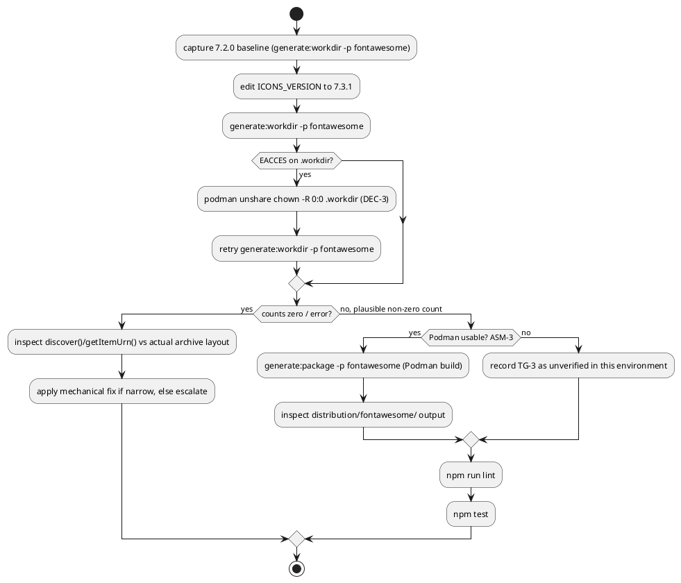

# Title

Font Awesome icons refresh for `@tmorin/plantuml-libs` (wave 001, run W-5)

# Summary

Move the Font Awesome sprite package from pinned release `7.2.0` to
`7.3.1`, using the repository's own
`.claude/skills/fontawesome-package-upgrading` procedure
(`doc/howto.upgrade-fontawesome-package.md`'s local steps — the
branch/PR/GitHub-Actions-pipeline steps in that howto are superseded here by
this wave's own single-branch, no-push convention; see Non-Goals). No PRD
exists for this run — **traceability is incomplete**; requirements below
are sourced directly from the wave manifest
(`docs/wav/wav-001-dependency-ci-refresh/wav-001-dependency-ci-refresh.md`,
run `W-5`) and its business case, per this run's `TDD+pln` document profile
(infra-only work, scope already settled by the wave, no `prd` needed — same
profile as sibling run 0001).

# Scope

In scope: `source/library/packages/fontawesome/index.ts`'s `ICONS_VERSION`
constant and, conditionally, its `discover()` glob pattern / `getItemUrn()`
path parsing if the 7.3.1 archive's internal directory layout differs from
7.2.0's; rebuilding and verifying the package via
`npm run generate:workdir -- -p fontawesome` and (environment permitting)
`npm run generate:package -- -p fontawesome`.

Out of scope: every other wave run's files (`package.json` dependency
bumps — W-1, already `completed`; `.github/workflows/**` — W-2;
`source/library/packages/{aws,azure,gcp,simpleicons}/**` — W-3/W-4/W-6/W-7);
the website/documentation ETL architecture; the release/publishing
pipeline; any Font Awesome *Pro* content (this package only ever fetched
the free web zip).

# PRD Traceability

No PRD exists for this run (`TDD+pln` profile). Requirements are sourced
directly from:

- Wave manifest `W-5` entry (`wav-001-dependency-ci-refresh.md`): "use
  fontawesome-package-upgrading to move Font Awesome from 7.2.0 to the
  confirmed-available 7.3.1."
- Wave manifest P2 table exit evidence: "Package rebuilds via `npm run
  generate:package -- -p fontawesome`; pinned version is 7.3.1."
- Business case (`wbc-001-dependency-ci-refresh.md`): "Font Awesome: latest
  GitHub release is `7.3.1`, pinned is `7.2.0`."

All three are addressed by this TDD; none are unresolved.

# Technical Goals

- `TG-1` — `source/library/packages/fontawesome/index.ts`'s `ICONS_VERSION`
  reads `"7.3.1"` and the package rebuilds cleanly from that version.
- `TG-2` — `npm run generate:workdir -- -p fontawesome` succeeds and
  discovers a plausible, non-zero icon/module count for 7.3.1 (compared
  against the 7.2.0 baseline captured before the change).
- `TG-3` — `npm run generate:package -- fontawesome` (full Podman-rendered
  PlantUML output into `distribution/fontawesome/`) succeeds end to end if
  Podman/Docker is available in this environment; if not, or if attempting
  it is explicitly withheld by user direction (see "Deliberate Scope
  Reduction" below — this run's actual outcome), this is recorded
  explicitly as a named, deliberate gap rather than silently skipped.
  **Note the corrected invocation**: `npm run generate:package -- -p
  fontawesome` (with a `-p` flag) is wrong — `scripts/generate-package.sh`
  already prepends `-p` internally and takes the bare package name as
  `$1`; passing `-p` from the command line makes the urn literally `"-p"`.
  This was discovered empirically during this run (see Deliberate Scope
  Reduction) and has been corrected in `CLAUDE.md` and the wave manifest's
  exit-evidence text by the orchestrator.
- `TG-4` — `npm run lint` and `npm test` remain green after the change (no
  regression to the rest of the repository).

# Non-Goals

- Does not follow `doc/howto.upgrade-fontawesome-package.md`'s
  branch/PR/GitHub-Actions-dispatch steps (create a feature branch, push,
  trigger `package-builder.yaml`, open a PR) — this wave's dispatch brief
  is explicit: commit locally on the current branch
  (`chore/upgrade-deps-and-ci-wave`), do not `git push`, do not open a PR.
  The howto's *content* steps (check the release, edit `ICONS_VERSION`,
  regenerate, verify outputs) are followed; its *delivery mechanism* is not.
- Does not touch `package.json`/`package-lock.json` (W-1's scope, already
  `completed`).
- Does not touch `.github/workflows/**` (W-2's scope).
- Does not touch any other icon/shape package (W-3/W-4/W-6/W-7's scope).
- Does not add Font Awesome Pro icons or change the license/attribution
  model — the factory only ever fetched the free web zip and continues to.

# Assumptions

- `ASM-1` — GitHub's `releases/latest` API response for
  `FortAwesome/Font-Awesome` (`tag_name: "7.3.1"`, published
  2026-07-15T18:15:54Z) is authoritative and current as of this run's
  execution (2026-10-04). Validated directly: `curl -s
  https://api.github.com/repos/FortAwesome/Font-Awesome/releases/latest`
  confirms `tag_name: "7.3.1"` with asset
  `fontawesome-free-7.3.1-web.zip` present — the exact filename shape the
  factory's `ICONS_URL` template expects
  (`fontawesome-free-${ICONS_VERSION}-web.zip`).
- `ASM-2` — the 7.3.1 web zip's internal directory structure
  (`*/svgs/**/*.svg`, i.e. a single top-level folder containing an `svgs/`
  tree split into brand/style families) matches 7.2.0's, so no change to
  `discover()`'s glob pattern or `getItemUrn()`'s path-parsing logic is
  needed. Validated empirically at Stage 10 by running
  `npm run generate:workdir -- -p fontawesome` against the new version and
  comparing the discovered module/item counts and names to the 7.2.0
  baseline (3 modules — `Brands`, `Regular`, `Solid` — 2860 items,
  captured before any source edit); if the structure changed, `discover()`
  would surface it as a sharp drop to zero or a parse error, per the
  skill's own "Icon discovery fails or icon count is zero" troubleshooting
  entry.
- `ASM-3` — this environment's Podman is usable for the full
  `generate:package` build (not just `generate:workdir`'s Podman-free
  `ts-node` step). Validated directly: `podman info` succeeds and
  `docker.io/thibaultmorin/plantuml-generator:1` is already present
  locally (`podman images`), unlike a sibling run's environment which
  reportedly lacked Podman/Docker entirely — this run's `CON-1` reflects
  that difference rather than assuming the same limitation.

# Constraints

- `CON-1` — Unlike a sibling icon-refresh run that reported Podman/Docker
  unavailable, this environment has both installed and working (`podman
  info` succeeds; the `plantuml-generator:1` image is already pulled), so
  `scripts/generate-package.sh` / `npm run generate:package -- -p
  fontawesome` is expected to be runnable and is used as a hard
  verification gate (`TG-3`), not skipped.
- `CON-2` — `.workdir/` and `distribution/` are generated, gitignored
  scratch directories shared across every wave-001 Phase-P2 run
  (W-3..W-7) that happens to execute concurrently in this same working
  tree. A prior Podman invocation's `-v ...:/workdir:z,U` volume mount
  (the `:U` flag recursively chowns the host-side mount to the container's
  rootless-subuid mapping) had already left `.workdir/` owned by a subuid
  this host user cannot write to when this run started; this run reclaims
  ownership via `podman unshare chown -R 0:0 .workdir` (non-destructive —
  fixes ownership without deleting any sibling run's in-progress content)
  rather than deleting and regenerating the shared directory outright,
  precisely because a concurrent sibling run may depend on it. See Risks.
- `CON-3` — No semicolons, double-quote strings (house style; `CON-3` in
  sibling run 0001's TDD) — any source edit must match.
- `CON-4` — This run does not push or open a pull request (dispatch brief,
  explicit) — commits land locally on the current branch only.

# Current State

- `source/library/packages/fontawesome/index.ts` line 13:
  `const ICONS_VERSION = "7.2.0"`; line 14 derives `ICONS_URL` from it.
- Baseline captured before any edit: `npm run generate:workdir -- -p
  fontawesome` against 7.2.0 discovers **2860** SVGs across **3 modules**
  (`fontawesome/Brands`, `fontawesome/Regular`, `fontawesome/Solid`).
- `source/templates/fontawesome/{bootstrap,documentation}.tera` exist and
  are referenced by the factory's `templates` field; no FA-specific test
  file exists under `test/` (unlike `resolve-aws-icons.spec.mjs` /
  `resolve-azure-icons.spec.mjs`), so this package has no dedicated spec to
  run beyond the general `npm test` suite and the generation pipeline
  itself.
- No `docs/adr/` register, no `docs/CLAUDE.md` register declaration, and no
  `docs/bkg/` directory exist in this repository (confirmed by directory
  listing) — no canonical/backlog register applies to this change.
- `.workdir/library.yaml`'s other package entries (`aws`, `gcp`, `material`,
  `simpleicons`) currently show `modules: []` — evidence that `.workdir/`
  is a shared, filter-scoped scratch artifact actively being
  regenerated/overwritten by concurrent sibling runs in this same working
  tree, not a stable reference state (see `CON-2`).

# Proposed Design

Follow `.claude/skills/fontawesome-package-upgrading/SKILL.md` →
`doc/howto.upgrade-fontawesome-package.md`'s content steps directly, minus
the branch/PR/dispatch delivery mechanism (`CON-4`, Non-Goals). No new
component, service, or architecture is introduced — this is a pinned-
version-and-regenerate change — so no component/class diagram applies.

`DEC-1` — Capture the 7.2.0 baseline (module/item counts) before editing
anything, so `TG-2`'s "plausible, non-zero" check has a concrete number to
compare against rather than just "not zero."

- Decision: run `npm run generate:workdir -- -p fontawesome` once against
  the current source, record the module list and item count, then proceed
  to the edit.
- Rationale: the skill's own troubleshooting section treats an unexpected
  icon-count *change* as worth checking, not alarming by itself (Font
  Awesome adds icons every release) — but zero or a drastic structural
  change is the actual failure signal (`ASM-2`), and a baseline is the only
  way to tell the difference.
- Alternatives considered: skip the baseline and just check "non-zero"
  after the bump — rejected, weaker signal, would not catch a structural
  glob-pattern break that still discovers *some* non-zero but wrong subset.
- Linked requirements: `TG-2`, `ASM-2`.

`DEC-2` — Edit only `ICONS_VERSION` (line 13) unless the 7.3.1 archive's
structure actually differs from 7.2.0's.

- Decision: change `const ICONS_VERSION = "7.2.0"` to `"7.3.1"`; run
  `generate:workdir`; only touch `discover()`'s glob pattern or
  `getItemUrn()`'s parsing if that run fails or produces a zero/implausible
  count (`ASM-2`'s empirical check).
- Rationale: `ICONS_URL` already derives from `ICONS_VERSION` (line 14),
  so a single-constant edit is the minimal change per the skill's own
  Step 3; widening to a structural edit without evidence of a real
  structure change would violate house-style's "match existing patterns"
  preference (`CON-3`) and this run's Scope.
- Alternatives considered: pre-emptively inspect the 7.3.1 zip's internal
  layout before editing — considered but unnecessary extra work given the
  empirical check happens immediately after the one-line edit anyway, at
  negligible cost (the factory already fetches and caches the archive on
  the very next `generate:workdir` run).
- Linked requirements: `TG-1`, `ASM-2`.

`DEC-3` — Treat `.workdir/`'s pre-existing permission hazard (`CON-2`) as
an environment fix-forward, not a scope expansion: reclaim ownership via
`podman unshare chown -R 0:0 .workdir`, never delete-and-regenerate the
shared directory wholesale while sibling runs may be using it concurrently.

- Decision: if `generate:workdir`/`generate:package` fails with `EACCES`
  on `.workdir/**`, run `podman unshare chown -R 0:0 .workdir` (rootless
  podman's standard remedy for a `:U`-mounted volume's host-side
  ownership) and retry, rather than `rm -rf .workdir` (which failed with
  the same permission error) or escalating to a human.
- Rationale: this is a mechanical environment-hygiene fix within this
  run's own verification path, not a design decision about the fontawesome
  package itself; it does not touch any file this run doesn't already need
  to touch for `TG-2`/`TG-3`.
- Alternatives considered: `sudo rm -rf .workdir` — rejected, needlessly
  destructive to any concurrent sibling run's in-progress scratch state,
  and this run has no evidence the directory needs wiping rather than
  just re-owning; escalate to a human — rejected, this is a bounded,
  reversible, well-understood rootless-Podman quirk, not a genuine
  blocker per the autonomy override.
- Linked requirements: `TG-2`, `TG-3`, `CON-2`.

# Repository Impact

`IMP-1` — `source/library/packages/fontawesome/index.ts`

- Path(s): `source/library/packages/fontawesome/index.ts`
- Change type: modify
- Why impacted: `ICONS_VERSION` constant bump (`DEC-2`); conditionally,
  `discover()`/`getItemUrn()` if `ASM-2` is proven wrong.
- Linked requirements: `TG-1`, `TG-2`
- Risks / notes: must stay the sole source of the pinned version — no
  parallel hardcoded version string elsewhere in the repo references
  `7.2.0`/`7.3.1` for this package (confirmed by repo-wide grep at drafting
  time: only this file, the wave's own planning docs, and `CHANGELOG.md`'s
  historical entry mention `7.2.0`; `CHANGELOG.md` is not edited by this
  run — it is regenerated by `standard-version` at release time, not by
  hand).

`IMP-2` — `source/templates/fontawesome/{bootstrap,documentation}.tera`

- Path(s): `source/templates/fontawesome/bootstrap.tera`,
  `source/templates/fontawesome/documentation.tera`
- Change type: none expected (read-only verification)
- Why impacted: the skill's Step 3.4 calls for reviewing these templates
  for icon-path assumptions that could break if the archive structure
  changed; since `DEC-2`/`ASM-2` expect no structural change, these are
  reviewed but not edited unless `ASM-2` is proven wrong.
- Linked requirements: `TG-2`, `TG-3`

# Canonical Impact

Not applicable — no canonical registers declared. This repository has no
`docs/adr/` register and no `docs/CLAUDE.md` register declaration (both
confirmed absent by directory listing at drafting time), so there is no
`arc`/`dom` register for this change to make stale, per the dispatch
brief's instruction to skip register-dependent steps rather than invent
one.

# Data Model and Contracts

No data structure, API boundary, or configuration file shape changes as a
result of this run. The `Item`/`Package` manifest shapes the factory
produces (`source/generator/workdir/manifest.ts`) are unchanged — only the
upstream data (icon SVGs) and the version string feeding into them differ.

# Interfaces and Behavior

No CLI/user-facing interface changes. The generated PlantUML sprite
library's *content* changes (new icons Font Awesome 7.3.1 adds since
7.2.0, if any rendering/discovery differences surface), but its *shape*
(module/item URN conventions, template bindings) does not.

# Flows and Processing Logic

`FLOW-1` — Version bump and verification loop

- Trigger: Stage 10 implementation start for this run.
- Steps:
  1. Capture the 7.2.0 baseline (`DEC-1`): `npm run generate:workdir -- -p
     fontawesome`, record module/item counts.
  2. Edit `ICONS_VERSION` to `"7.3.1"` (`DEC-2`).
  3. Re-run `npm run generate:workdir -- -p fontawesome`; compare counts
     against the baseline (`ASM-2`/`TG-2`). On `EACCES` from a stale
     `.workdir/` ownership, apply `DEC-3` and retry.
  4. If counts are zero or the run errors, treat as `ASM-2` disproven and
     investigate `discover()`/`getItemUrn()` against the actual archive
     layout (fix-vs-escalate per Escalation Rules below) — otherwise
     proceed.
  5. If Podman/Docker is usable (`ASM-3`, confirmed at Stage 0): run
     `npm run generate:package -- -p fontawesome` (`TG-3`) and inspect
     `distribution/fontawesome/` output.
  6. Run `npm run lint` and `npm test` over the full repository (`TG-4`).
  7. Record final counts, any structural findings, and verification
     results in the prg.
- Branches / failure paths: a genuine archive-structure change
  (`ASM-2` disproven) that requires more than a mechanical glob/path-parse
  fix is a candidate for the autonomy override's "unresolvable" bar only if
  it turns into a real redesign question — a mechanical fix stays inline.
- Final output / rendered result: `source/library/packages/fontawesome/index.ts`
  pinned at `7.3.1`; `distribution/fontawesome/` rebuilt (if `ASM-3` holds);
  `npm run lint`/`npm test` green.
- Linked requirements: `TG-1`, `TG-2`, `TG-3`, `TG-4`.

A reviewer should check that the diagram's `EACCES` branch matches `DEC-3`
(reclaim ownership, never wholesale-delete a shared directory), and that
the zero-count branch never silently treats an empty/implausible discovery
as success.

# Reliability, Performance, and Scalability

Not materially affected — a one-time content/version bump to a static
sprite package, not a runtime reliability or performance change. The only
latent risk is the shared `.workdir`/`distribution` scratch-directory
contention noted in `CON-2`/Risks, which is an environment concern for
this wave's concurrent batch, not an ongoing production concern.

# Security and Privacy

No credentials, secrets, or privacy-sensitive data are touched. The
`fetchArchive` call downloads a public GitHub release asset over HTTPS, as
it already did for 7.2.0 — no change to that trust boundary.

# Observability and Verification

Verification runs exactly the checks named in `TG-2` (`generate:workdir`
plausibility) and `TG-4` (`lint`/`test`) — see those for the pass/fail
criteria, not restated here. **`TG-3` is explicitly not met** by this run
— see "Deliberate Scope Reduction" — so the actual verification basis for
this run's completion is `TG-2` + `TG-4` only, not the originally-planned
`TG-2` + `TG-3` + `TG-4`. No visual spot-check of
`distribution/fontawesome/`'s generated output was possible since that
directory was never rebuilt against 7.3.1 by this run.

# Deployment and Rollout

Code-only change (one constant, conditionally template/discovery logic).
No data migration, no external service dependency change, no feature flag.
Rollback is `git revert` of this run's commit — deterministic, since the
factory re-fetches the archive fresh on every generation run. This TDD
does not authorize publishing, pushing, or opening a pull request
(`CON-4`) — `npm run release`/`release:publish`/`alpha:publish` are not
invoked by this run.

# Risks and Tradeoffs

- `RISK-1` — The shared `.workdir`/`distribution` scratch directories are
  being concurrently read/written by other Phase-P2 sibling runs (W-3,
  W-4, W-6, W-7) in this same working tree. A sibling run's
  `generate:workdir -p <other-pkg>` call (filtered to its own package)
  does not touch fontawesome's module data, but a *full* unfiltered
  `generate:workdir` or `generate-library.sh` call from elsewhere could
  overwrite `library.yaml` mid-verification. Mitigation: this run always
  passes `-p fontawesome` explicitly and re-reads `.workdir/library.yaml`
  immediately after its own generation call rather than trusting a cached
  read; if a check looks wrong, re-run generation before concluding
  failure.
- `RISK-2` — The rootless-Podman `:U` volume-mount ownership hazard
  (`CON-2`) could recur mid-run if a sibling run's own `generate:package`
  call re-chowns `.workdir` while this run is mid-verification.
  Mitigation: `DEC-3`'s fix is cheap and idempotent — re-apply
  `podman unshare chown -R 0:0 .workdir` and retry if it recurs; this is
  not escalated as a blocker unless it recurs so persistently that no
  verification attempt can complete.
- `RISK-3` — Font Awesome 7.3.1 could rename, remove, or restructure icon
  families in a way `ASM-2` doesn't anticipate (not just add icons).
  Mitigation: `FLOW-1`'s baseline comparison catches a module-count or
  family-name change, not just a raw item-count delta; a surprising delta
  is investigated before being accepted as "plausible."
- `RISK-4` (realized, not hypothetical) — `RISK-1`/`RISK-2` understated the
  actual severity of the shared-scratch-directory contention. In practice,
  concurrent Phase-P2 Podman builds on this single host (gcp, simpleicons,
  azure running alongside this run's own fontawesome attempts) caused: (a)
  repeated `.workdir`/`distribution` ownership flips requiring repeated
  `podman unshare chown` fixes; (b) a full-`:U`-mount collateral deletion
  of repo-wide aggregate files (`distribution/README.md`,
  `distribution/bootstrap.puml`) and of this package's own entire
  `distribution/fontawesome/**` tree on every `--clean-urn=fontawesome`
  run, restored via `git checkout --` each time; (c) a host memory/swap
  exhaustion (observed: ~1.9Gi/1.9Gi swap used, 11Gi/31Gi RAM used while
  multiple Java/Inkscape render processes ran concurrently) that is the
  most likely cause of a `PLANTUML_GENERATOR_THREADS=1` render attempt
  being killed with `EXIT=137` (`SIGKILL`, consistent with an OOM kill)
  after several minutes; (d) a `.git/index.lock` collision from a sibling
  run's concurrent commit while this run attempted its own `git checkout
  --` cleanup, requiring a short wait-and-retry. None of this corrupted
  committed repository state — every collateral change was to gitignored
  scratch (`.workdir/`) or to tracked-but-regeneratable output
  (`distribution/`) and was fully recoverable via `git checkout --`/`git
  clean` before this run committed anything. See "Deliberate Scope
  Reduction" below for the resulting, user-directed decision.

# Deliberate Scope Reduction (user-directed)

After four attempted full containerized builds of
`distribution/fontawesome/**` via `npm run generate:package -- fontawesome`
all failed or were abandoned for the reasons in `RISK-4` (two early
attempts used the wrong `-p fontawesome` invocation and never targeted the
right package at all — see `TG-3`'s note; two corrected attempts then hit
real host contention: one `EXIT=2` file-not-found race during multi-threaded
rendering, one `EXIT=137` likely-OOM kill during a single-threaded retry
started to test a race-condition hypothesis), the user directed via the
orchestrator: stop attempting the full containerized render in this session
entirely, rely on `npm run generate:workdir -- -p fontawesome`'s
Podman-free verification as sufficient evidence the version bump is
structurally correct (`TG-2`, already met: 2883 items / 3 modules vs. the
2860/3 baseline — see Observability and Verification), and commit only the
source-level version bump.

**Resulting, explicit decision**: `distribution/fontawesome/**` is left at
its last-committed (7.2.0-era) rendered state by this run — it does **not**
yet reflect 7.3.1's content. `TG-3` (full Podman build) is explicitly
**not met** by this run, by user direction, not by oversight or silent
skip. The follow-up path: once this branch is pushed, the repository's own
`.github/workflows/package-builder.yaml` (`workflow_dispatch`, inputs
`pkgName`/`pkgVersion`) can run the equivalent full build
(`generate:workdir` + Podman render) on GitHub Actions' own infrastructure
instead of this contended local host. This run does not trigger that
workflow — it is named here only as the intended next step for whoever
picks this up.

An optional secondary sanity check (building the small, fast `eip` package
instead, per the user's own suggested substitute) was attempted once,
interrupted by an external timeout wrapper, its collateral
(`distribution/eip/**`, `distribution/README.md`, `distribution/bootstrap.puml`)
restored cleanly via `git checkout --`/`git clean`, and not retried — the
user's direction already made it optional, and repeating it risked more of
the same contention for no requirement it resolve.

# Open Questions

None — the wave manifest and business case fully specify the target
version (7.3.1, confirmed current via GitHub's API at drafting and again
at Stage 3 below), and the only genuinely empirical question (whether the
7.3.1 archive's internal structure matches 7.2.0's) is resolved by this
run's own `FLOW-1`, not pre-answered here.

# Deferred Work

- `DEF-1` — `RISK-1`/`RISK-2`'s shared-scratch-directory contention across
  concurrently-dispatched Phase-P2 wave runs is a wave-level process gap
  (no run-level fix changes the fact that `.workdir`/`distribution` are
  shared, un-namespaced build artifacts across a parallel batch). Not
  addressed by this run; worth the wave orchestrator's attention if a
  future wave dispatches more Phase-P2-shaped batches concurrently. No
  `docs/bkg/` register exists in this repository to file it against, so it
  is recorded here and in this run's prg, and separately surfaced in this
  run's final report as a wave-level finding.
- `DEF-2` — The full Podman-rendered `distribution/fontawesome/**` build
  for 7.3.1 (`TG-3`) is deferred, per "Deliberate Scope Reduction" above.
  Whoever picks this up next should either: (a) run
  `npm run generate:package -- fontawesome` (corrected invocation, no
  `-p`) locally once the host is no longer contended by a concurrent
  batch, or (b) dispatch `.github/workflows/package-builder.yaml` via
  `workflow_dispatch` (`pkgName: fontawesome`) on CI infrastructure after
  this branch is pushed. Not scheduled by this run; no `docs/bkg/`
  register exists to file it against formally.

# File Placement

Saved at
`docs/wav/wav-001-dependency-ci-refresh/run/run-0005-fontawesome-icons-refresh/tdd-0005-fontawesome-icons-refresh.md`,
matching this run's wave-owned directory convention (no separate
`docs/run/` path exists for a wave-owned run). Frontmatter is as declared
at the top of this document.
