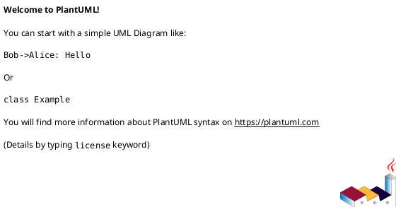

# GCP - Google Compute Platform

## Include the library

Include remotely the library:
```plantuml
@startuml
!global $GCP_LIB_BRANCH="master"
!global $GCP_LIB_BASE_URL="https://raw.githubusercontent.com/tmorin/plantuml-libs/" + $GCP_LIB_BRANCH + "/gcp"
!includeurl $GCP_LIB_BASE_URL/library.puml
@enduml
```

Include locally the library:
```plantuml
@startuml
!global $INCLUSION_MODE="local"
!include library.puml
@enduml
```

## Include the sub-libraries

Additional sub-libraries can be included.



## Sub libraries

- [The Groups](groups.md)
- [The Elements](elements/README.md)
