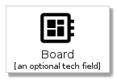
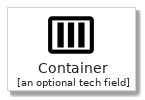
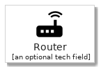
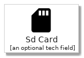
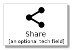
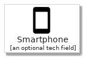
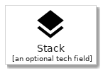

# materials - Elements
## elements/materials
| | Name |
| :-: | --- |
|  | [MaterialsBoard](MaterialsBoard.md) `elements/materials/MaterialsBoard` |
|  | [MaterialsCloud](MaterialsCloud.md) `elements/materials/MaterialsCloud` |
|  | [MaterialsContainer](MaterialsContainer.md) `elements/materials/MaterialsContainer` |
|  | [MaterialsDns](MaterialsDns.md) `elements/materials/MaterialsDns` |
|  | [MaterialsLaptop](MaterialsLaptop.md) `elements/materials/MaterialsLaptop` |
|  | [MaterialsLock](MaterialsLock.md) `elements/materials/MaterialsLock` |
|  | [MaterialsMail](MaterialsMail.md) `elements/materials/MaterialsMail` |
|  | [MaterialsNetwork](MaterialsNetwork.md) `elements/materials/MaterialsNetwork` |
|  | [MaterialsPeople](MaterialsPeople.md) `elements/materials/MaterialsPeople` |
|  | [MaterialsPerson](MaterialsPerson.md) `elements/materials/MaterialsPerson` |
|  | [MaterialsRegistry](MaterialsRegistry.md) `elements/materials/MaterialsRegistry` |
|  | [MaterialsRouter](MaterialsRouter.md) `elements/materials/MaterialsRouter` |
|  | [MaterialsSdCard](MaterialsSdCard.md) `elements/materials/MaterialsSdCard` |
|  | [MaterialsSecurity](MaterialsSecurity.md) `elements/materials/MaterialsSecurity` |
|  | [MaterialsService](MaterialsService.md) `elements/materials/MaterialsService` |
|  | [MaterialsShare](MaterialsShare.md) `elements/materials/MaterialsShare` |
|  | [MaterialsSmartphone](MaterialsSmartphone.md) `elements/materials/MaterialsSmartphone` |
|  | [MaterialsStack](MaterialsStack.md) `elements/materials/MaterialsStack` |
|  | [MaterialsStorage](MaterialsStorage.md) `elements/materials/MaterialsStorage` |
|  | [MaterialsSync](MaterialsSync.md) `elements/materials/MaterialsSync` |
|  | [MaterialsUsb](MaterialsUsb.md) `elements/materials/MaterialsUsb` |
