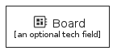
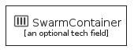

# materials - Groups
## groups/materials
| | Name |
| :-: | --- |
|  | [MaterialsGroupBoard](MaterialsGroupBoard.md) `groups/materials/MaterialsGroupBoard` |
|  | [MaterialsGroupCloud](MaterialsGroupCloud.md) `groups/materials/MaterialsGroupCloud` |
|  | [MaterialsGroupDockerregistry](MaterialsGroupDockerregistry.md) `groups/materials/MaterialsGroupDockerregistry` |
|  | [MaterialsGroupLock](MaterialsGroupLock.md) `groups/materials/MaterialsGroupLock` |
|  | [MaterialsGroupNetwork](MaterialsGroupNetwork.md) `groups/materials/MaterialsGroupNetwork` |
|  | [MaterialsGroupSwarmcontainer](MaterialsGroupSwarmcontainer.md) `groups/materials/MaterialsGroupSwarmcontainer` |
|  | [MaterialsGroupSwarmservice](MaterialsGroupSwarmservice.md) `groups/materials/MaterialsGroupSwarmservice` |
|  | [MaterialsGroupSwarmstack](MaterialsGroupSwarmstack.md) `groups/materials/MaterialsGroupSwarmstack` |
