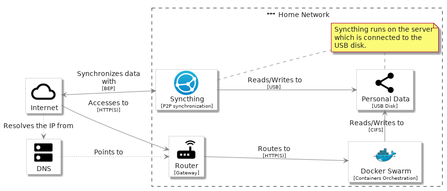

# Examples
## simple - simple

```plantuml
@startuml simple
'!global $LIB_BRANCH="master"
'!global $LIB_BASE_LOCATION="https://raw.githubusercontent.com/tmorin/plantuml-libs/" + $LIB_BRANCH + "/perso"
'!includeurl $LIB_BASE_LOCATION/library.puml

!global $INCLUSION_MODE="local"
!global $LIB_BASE_LOCATION="../"
!include ../library.puml

include('elements/materials/MaterialsCloud')
include('elements/materials/MaterialsDns')
include('elements/materials/MaterialsRouter')
include('elements/materials/MaterialsShare')
include('groups/materials/MaterialsGroupNetwork')
include('elements/brand/BrandDocker')
include('elements/brand/BrandSyncthing')

left to right direction

MaterialsCloud('internet', 'Internet')
MaterialsDns('dns', 'DNS')
MaterialsGroupNetwork('home', 'Home Network') {
  MaterialsRouter('router', 'Router', 'Gateway')
  BrandDocker('swarm', 'Docker Swarm', 'Containers Orchestration')
  BrandSyncthing('syncthing', 'Syncthing', 'P2P synchronization')
  MaterialsShare('disk', 'Personal Data', 'USB Disk')
  note as N1
  Syncthing runs on the server which is connected to the USB disk.
  end note
  N1 .u. syncthing
  N1 . disk
}

syncthing --> disk : fmtLabel('Reads/Writes to', 'USB')
syncthing <-u-> internet : fmtLabel('Synchronizes data with', 'BEP')
internet ~> dns : fmtLabel('Resolves the IP from')
internet --> router : fmtLabel('Accesses to', 'HTTP(S)')
router --> swarm : fmtLabel('Routes to', 'HTTP(S)')
dns ~~> router : fmtLabel('Points to')
swarm -l-> disk : fmtLabel('Reads/Writes to', 'CIFS')
@enduml
```
